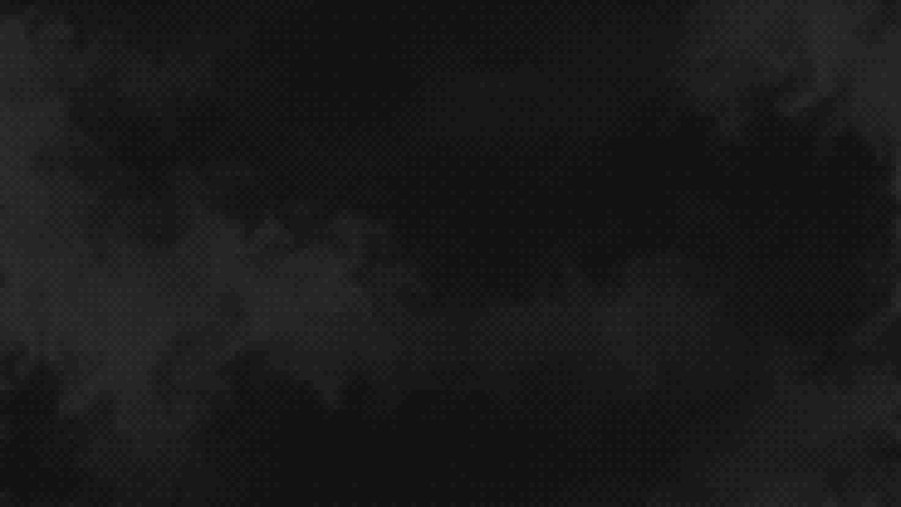
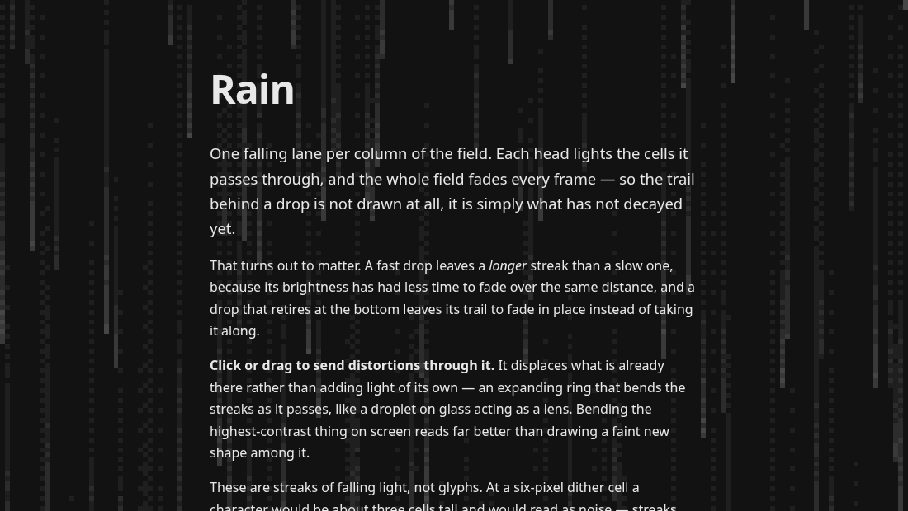
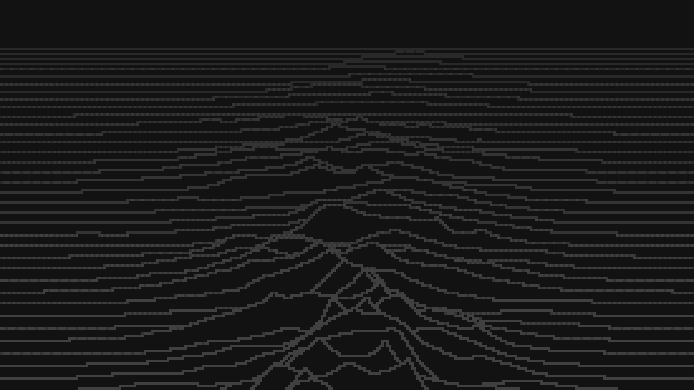
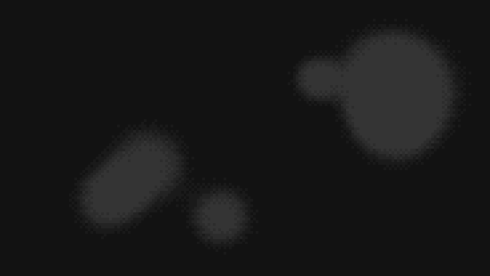
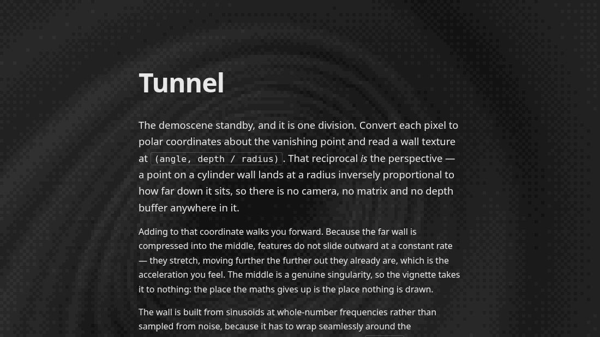

# canvas-effects

Seven animated, ordered-dithered greyscale backgrounds for a 2D canvas. They are built to sit **behind body text**, so they
modulate the page colour rather than becoming a picture, and they are quiet enough that a reader should not consciously
notice them.

No WebGL, no shaders, no dependencies. A 2D context, some typed arrays and `putImageData`. All seven together are 12.4 kB
minified and gzipped.

```bash
npm install canvas-effects
```

## The effects

Each takes a canvas and returns a handle. All seven respond to the pointer.



**Smoke** — `createSmokeBackground`. A fluid simulation: semi-Lagrangian advection with a Jacobi pressure projection, the
scheme from Jos Stam's _Stable Fluids_. It has momentum, so eddies get spun up by the flow and persist after whatever made
them has gone. Every ten seconds or so a jet fires in from a random edge, about half of them dark. _Drag to stir it._


**Plasma** — `createPlasmaBackground`. A domain warp: fractal Brownian motion folded into itself,
`fbm(p + fbm(p + fbm(p)))`, sampling a seamless tile. Stateless in time, so a frame can be drawn at any moment without
having drawn the ones before it. _Click or drag to send ripples out._



**Rain** — `createRainBackground`. One falling lane per column. Each head lights the cells it passes and the whole field
fades every frame, so a trail is not drawn at all — it is simply what has not decayed yet. Streaks of falling light, not
glyphs. _Click or drag to send lens-like distortions through it._



**Ridges** — `createRidgesBackground`. A landscape flown over as a stack of profiles, each hiding the ones behind it. The
look is the ridgeline plot made famous by the cover of Joy Division's _Unknown Pleasures_. Optional `fill` makes them
solid silhouettes, `fillRandom` gives each its own colour. _Click or drag to set wobbles running through the stack._


**Fire** — `createFireBackground`. The classic cellular fire: the bottom row is re-fuelled each frame, then every cell
takes the heat below it minus a random amount, displaced sideways. In greyscale it reads as embers; give it a warm
[ramp](#colour) and it reads as flame. _Click or drag to throw sparks in._



**Metaballs** — `createMetaballsBackground`. An implicit surface. Point sources each add a falloff to a shared field,
which is thresholded — so blobs bulge towards each other, fuse with a smooth neck, and part without a seam. Nothing in the
code knows about necks. _Press and drag to pick a blob up and throw it._



**Tunnel** — `createTunnelBackground`. The demoscene standby, and it is one division: read a wall texture at
`(angle, depth / radius)` and that reciprocal _is_ the perspective — no camera, no matrix, no depth buffer. The corridor
winds and the view banks into the turn, which costs one extra pass of a fixed-point iteration. _Press and drag to steer
it._

## Quick start

```html
<canvas id="bg" aria-hidden="true"></canvas>

<style>
  #bg {
    position: fixed;
    inset: 0;
    width: 100%;
    height: 100%;
    z-index: -1;
    pointer-events: none;
    image-rendering: pixelated;
  }
</style>

<script type="module">
  import { createSmokeBackground } from 'canvas-effects';

  createSmokeBackground(document.getElementById('bg'), {
    shading: { base: 18, amplitude: 26 },
  });
</script>
```

Three things there are load-bearing, not decoration:

- **`image-rendering: pixelated`** — the canvas is drawn at one pixel per dither cell and stretched up by CSS. Let the
  browser smooth it and you have undone the entire dither.
- **`pointer-events: none`** — a full-bleed fixed canvas would otherwise eat every click on the page. It is also why every
  interaction listens on `window`: the canvas never sees a pointer itself.
- **`base` must match the colour of the page behind it.** The canvas is opaque and paints the page colour itself, so a
  mismatch shows as a seam at the canvas edge.

`create*` returns **`null`** if the browser will not give up a 2D context — the one failure worth handling, since the page
should carry on without a background rather than throw:

```js
const handle = createSmokeBackground(canvas, options);
if (!handle) canvas.remove();
```

## The handle

```js
handle.start(); // resume the loop
handle.stop(); // pause it, keep the state
handle.refresh(); // re-read shading and repaint
handle.destroy(); // stop and remove every listener
handle.canvas; // the canvas it is mounted on
```

`destroy()` removes everything it added, so mounting and unmounting in a single-page app does not leak.

## Shading

`shading` is either a fixed object or a function returning one. A function is re-read whenever the theme might have
changed — by default the library watches both the `class` on `<html>` and the OS `prefers-color-scheme`.

```js
createSmokeBackground(canvas, {
  shading: () => {
    const dark = document.documentElement.classList.contains('dark');
    return dark ? { base: 18, amplitude: 26 } : { base: 255, amplitude: -22 };
  },
});
```

- **`base`** — the page colour being modulated, 0–255. Must match what is behind the canvas.
- **`amplitude`** — how far the effect moves that colour. Negative moves it down, which is what a light theme wants.
  **This is the readability dial.**
- **`tint`** — optional `[r, g, b]` multipliers on `amplitude`. Only the modulation is tinted, never `base`, so the effect
  reads as coloured light over the page rather than a coloured rectangle.
- **`ramp`** — optional colour ramp, below.

A theme change only re-shades; the field is untouched, because only the greys it maps onto have changed.

### Colour

A tint scales one hue. A **ramp** gives each palette level its own colour, which buys the one thing greyscale cannot: a
steep perceptual gradient. It is what lets the fire read as flame rather than as embers.

```js
createFireBackground(canvas, {
  levels: 5,
  shading: {
    base: 18,
    amplitude: 0,
    ramp: [
      [18, 18, 18], // has to be your page colour
      [92, 16, 4],
      [190, 66, 8],
      [244, 158, 30],
      [255, 240, 200],
    ],
  },
});
```

Stops are sampled evenly, so ramp length and `levels` are independent: three stops across a nine-level palette
interpolates, nine across three takes the ends and the middle. `levels` decides how many distinct colours reach the
screen; the ramp decides which. `buildPalette(shading, levels)` is exported if you want to see what a shading resolves to.

## Interaction

| Effect    | Press or drag                                                            |
| --------- | ------------------------------------------------------------------------ |
| Smoke     | Stirs the fluid along the drag. Idle movement is ignored.                |
| Plasma    | Sends ripples out; a drag leaves a wake.                                 |
| Rain      | Sends lens-like distortions through it.                                  |
| Ridges    | Sets wobbles running through the stack.                                  |
| Fire      | Throws sparks of fuel in; a drag paints a trail of plumes, like a brush. |
| Metaballs | Picks the nearest blob up, carries it, and throws it when you let go.    |
| Tunnel    | Steers the vanishing point towards the pointer, easing back on release.  |

`interactive: false` turns any of them off. Emissions are spaced by _distance_ along the drag rather than throttled by
time, so a slow careful drag lays down as densely as a fast one. Each effect caps how many disturbances run at once and
retires the **oldest** to make room, so a long drag keeps responding instead of going quiet.

**One thing to know before enabling this on a page of prose:** a drag meant for the background is also a drag meant for
the browser's text selection, and both happen. The library does not touch `user-select` — whether reading or interacting
matters more is the page's decision, not a background's. Set it yourself if you want drags to belong to the background;
the demo does.

## Options

Every effect takes the same shape of options object. These are shared:

| Option                 | Default       | Does                                                                |
| ---------------------- | ------------- | ------------------------------------------------------------------- |
| `pixelSize`            | `6`           | CSS pixels per rendered pixel — one dither cell. Bigger is cheaper. |
| `fieldScale`           | varies        | How much coarser the field is than the output, per axis.            |
| `maxPixels`            | `160000`      | Ceiling on rendered pixels; raises `pixelSize` on large windows.    |
| `levels`               | `5`           | Palette size. Small on purpose — the dither makes it look smooth.   |
| `dither`               | `true`        | Off posterises flat: same palette, visible bands.                   |
| `gamma`                | varies        | Weights the field dark (above 1) or light (below).                  |
| `fps`                  | `24`          | Redraw rate.                                                        |
| `shading`              | auto          | The greys. See above.                                               |
| `interactive`          | `true`        | Respond to the pointer.                                             |
| `respectReducedMotion` | `true`        | Draw one frame and stop under `prefers-reduced-motion: reduce`.     |
| `pauseWhenHidden`      | `true`        | Stop the loop while the tab is hidden.                              |
| `watchThemeClass`      | `true`        | Re-read `shading` when the `class` on `<html>` changes.             |
| `watchColorScheme`     | `true`        | Re-read `shading` when the OS colour scheme changes.                |
| `random`               | `Math.random` | Pass a seeded generator for a repeatable background.                |

Three of those differ per effect, and the reasons are worth knowing:

| Effect    | `fieldScale` | `pixelSize` | `gamma` |
| --------- | ------------ | ----------- | ------- |
| Smoke     | 2            | 6           | 1.6     |
| Plasma    | 2            | 6           | 1.18    |
| Metaballs | 2            | 6           | 1       |
| Rain      | **1**        | 6           | 1       |
| Fire      | **1**        | 6           | **0.6** |
| Ridges    | **1**        | **4**       | 1       |
| Tunnel    | **1**        | 6           | 1       |

`fieldScale: 1` wherever interpolating between cells would blur line art or smooth away fine structure — for the
tunnel that is the difference between visible rings and flat mottle. `gamma` below 1
_brightens_ — only the fire wants that. [How it works](docs/how-it-works.md) has the measurements behind each.

Each effect also has its own parameter group — `simulation`, `warp`, `rain`, `ridges`, `fire`, `metaballs`, `tunnel` —
merged over that effect's defaults. Every parameter is documented where it is declared, with a note on what it does and where its
default came from: `SmokeParams`, `PlasmaWarpConfig`, `RainParams`, `RidgeParams`, `FireParams`, `MetaballParams`, `TunnelParams`.

`undefined` is ignored rather than overriding a default, so forwarding your own optional config is safe:

```js
createSmokeBackground(canvas, { gamma: config.gamma }); // fine when config.gamma is undefined
```

## Performance

All seven draw at `fps` — 24 by default — rather than the refresh rate, and stop entirely when the tab is hidden.

What makes them cheap is that they render at **two resolutions**: the expensive field is computed coarsely and
interpolated up, then ordered-dithered per output pixel, which is a few multiply-adds and a table lookup. `maxPixels`
raises `pixelSize` on large windows, so 2560×1440 renders 147,000 pixels rather than 409,000.

For the smoke, `maxSimCells` is the number to reach for first, not `maxPixels`: the solver touches every cell a dozen or
more times a frame where the shading touches each output pixel once.

## Accessibility

- The canvas is decoration. Mark it `aria-hidden="true"`.
- With `prefers-reduced-motion: reduce` all seven draw a single frame and stop, and pointer interaction is disabled. The
  stateful ones settle themselves first, so the still frame is smoke or mid-storm rain rather than an empty field.
- With JavaScript off nothing is painted and the page keeps its ordinary background — the other reason `base` has to match
  your page colour.
- `amplitude` is the contrast dial. Keep it low enough that text over the background clears whatever contrast ratio you
  are targeting. A `ramp` or `tint` adds chroma contrast on top of luminance contrast, and colour-blind readers do not all
  benefit from it equally; greyscale is the safer default and is why it is the default.

## More

- **[How it works](docs/how-it-works.md)** — what each effect actually does, why, and where the numbers came from.
- **[`examples/vanilla.html`](examples/vanilla.html)** — the smallest thing that works, no build step.
- **[`examples/astro/`](examples/astro)** — Astro components, including the view-transitions handling.
- **[`demo/`](demo)** — the live tuning page, every dial as a slider. `npm run dev`.

Everything is exported, and the maths is DOM-free so it can be used and tested outside a browser — the fluid solver, the
warp, the falling lanes, the terrain, the heat field, the implicit surface and the tunnel projection are all usable on
their own.

## Development

```bash
npm install
npm run dev      # the demo page
npm test         # vitest
npm run check    # types, lint, format
npm run build    # dist/, via tsc
```

The tests cover the maths, because that is the part with properties worth asserting: the pressure projection really does
remove the divergence, the Bayer matrix really does average to 0.5, the MacCormack clamp really does keep density in
range. The canvas and loop code is exercised by the demo page.

## Licence

MIT — see [LICENSE](LICENSE).

All seven implement published techniques: Jos Stam's _Stable Fluids_, domain-warped fbm, the classic cellular fire,
Wyvill's falloff for the metaballs, the demoscene reciprocal tunnel, and ordered dithering on a Bayer matrix throughout. Where a well-known constant is used it is
credited at the point of use — MurmurHash3's public-domain finalisers in `hash2`, and the classic 4×4 Bayer matrix.
