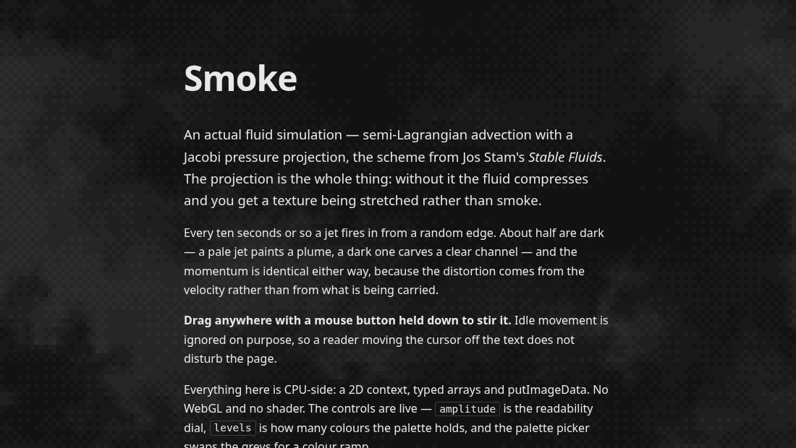
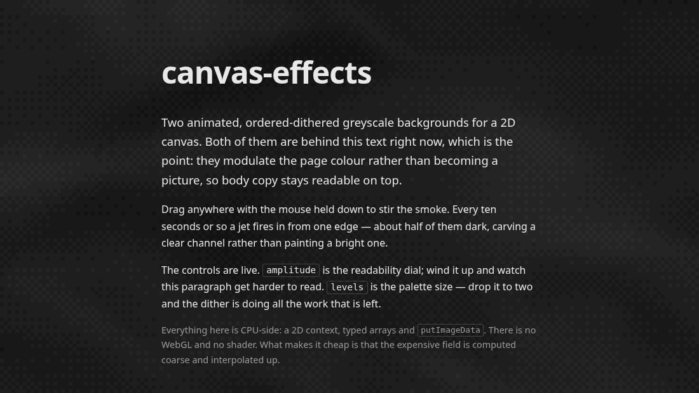
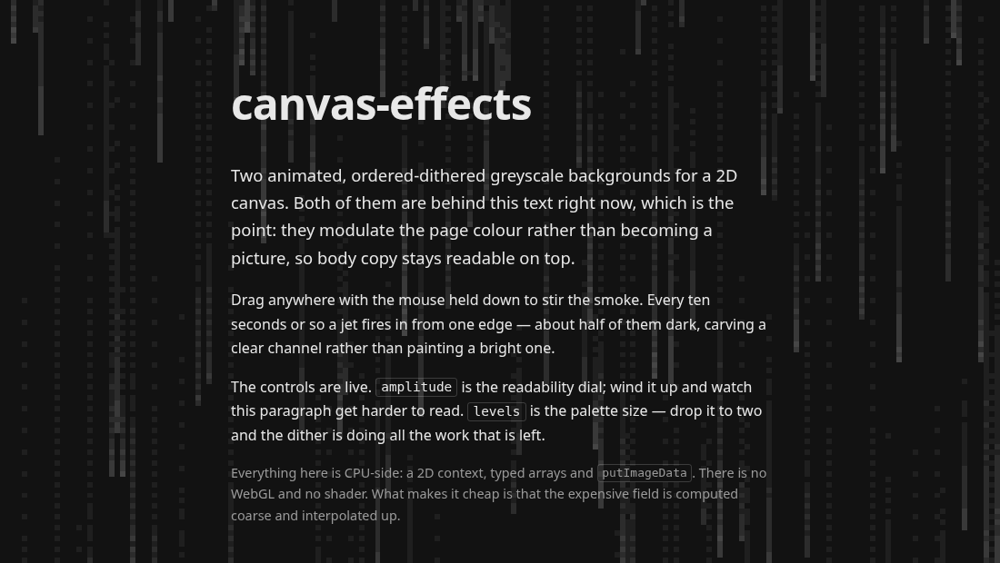
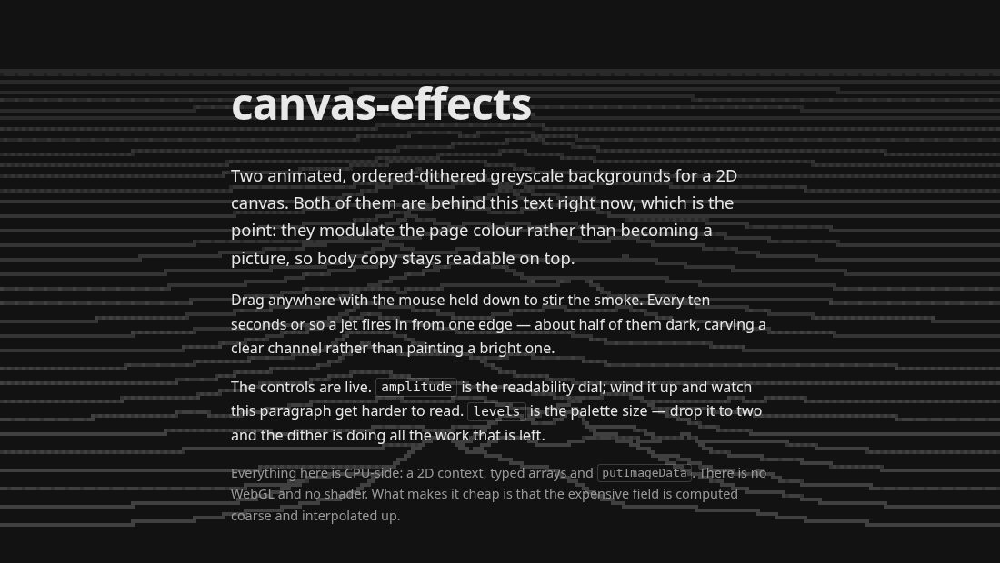
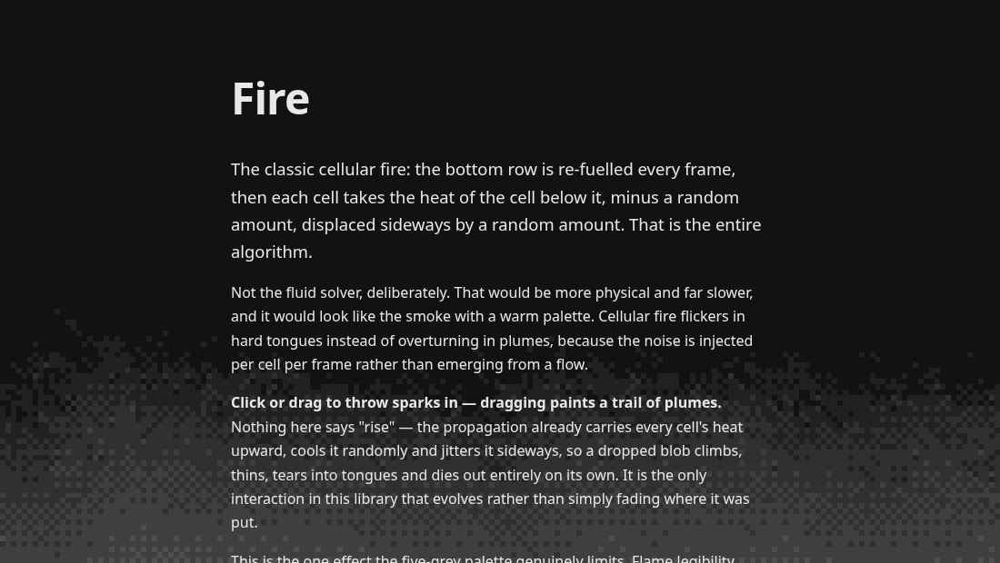
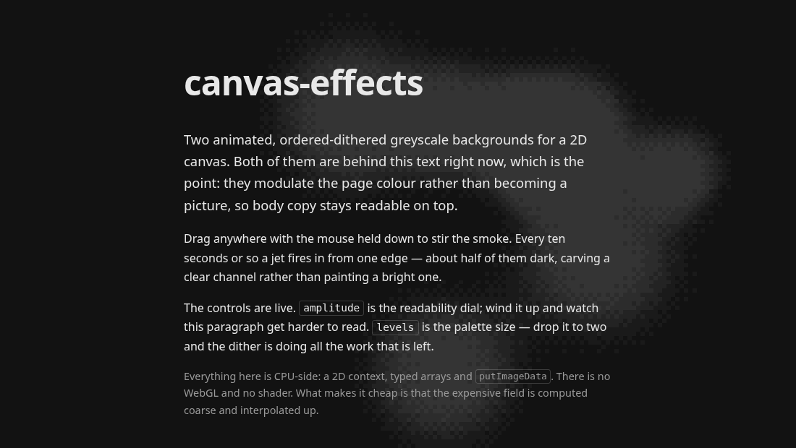

# canvas-effects

Six animated, ordered-dithered greyscale backgrounds for a 2D canvas. They are built to sit **behind body text**, so
they modulate the page colour rather than becoming a picture, and they are quiet enough that a reader should not
consciously notice them.

No WebGL, no shaders, no dependencies. A 2D context, some typed arrays and `putImageData`.



**Smoke** is an actual fluid simulation — semi-Lagrangian advection with a Jacobi pressure projection, the scheme from
Jos Stam's _Stable Fluids_. It has momentum: eddies get spun up by the flow, persist after whatever made them has gone,
and interact. Every ten seconds or so a jet fires in from a random edge and shoves everything aside. Dragging the cursor
stirs it.



**Plasma** is a domain warp — fractal Brownian motion folded into itself, `fbm(p + fbm(p + fbm(p)))` — sampling a
seamless plasma tile. Cheaper than the smoke and stateless in time, so it can be drawn at any moment without having
drawn the moments before it.



**Rain** is Matrix-style digital rain: one falling lane per column, each head lighting the cells it passes and the
whole field decaying behind it. Greyscale by default like its siblings, with an optional tint if you want the green.
Note what it is not — these are streaks of falling light, **not glyphs**. See [Why no characters](#why-no-characters).



**Ridges** is a landscape flown over as a stack of horizontal profiles, each hiding the ones behind it. The look is the
ridgeline plot made famous by the cover of Joy Division's _Unknown Pleasures_ — Peter Saville's design of a figure from
Harold Craft's 1970 thesis plotting radio pulses from the pulsar CP 1919. That is the visual reference; the plot type
itself is an ordinary statistical graphic and nothing here derives from the cover or the data.



**Fire** is the classic cellular fire: a heat field fuelled along the bottom edge and carried upward, cooling as it
climbs. Greyscale by default, where it reads as embers or heat haze at the foot of the page. It is the one effect whose
look is genuinely limited by the five-grey palette — see [What it looks like, honestly](#what-it-looks-like-honestly).



**Metaballs** are an implicit surface: point sources each contribute a falloff to a shared field, which is thresholded
to a surface. Blobs bulge towards each other as they approach, fuse with a smooth neck, and part again without a seam.
Nothing in the code knows about necks — there is only a sum and a threshold.

---

## Contents

- [Install](#install)
- [Quick start](#quick-start)
- [How they work](#how-they-work)
  - [The shared half: two resolutions and a dither](#the-shared-half-two-resolutions-and-a-dither)
  - [Smoke: a fluid solver](#smoke-a-fluid-solver)
  - [Plasma: a domain warp](#plasma-a-domain-warp)
  - [Rain: falling lanes](#rain-falling-lanes)
  - [Ridges: a landscape flown over](#ridges-a-landscape-flown-over)
  - [Fire: heat climbing](#fire-heat-climbing)
  - [Metaballs: an implicit surface](#metaballs-an-implicit-surface)
- [Using it](#using-it)
  - [Shading and themes](#shading-and-themes)
  - [The handle](#the-handle)
  - [Options](#options)
  - [Tuning](#tuning)
- [Performance](#performance)
- [Accessibility](#accessibility)
- [Using the pieces on their own](#using-the-pieces-on-their-own)
- [Examples](#examples)
- [Development](#development)
- [Licence](#licence)

---

## Install

```bash
npm install canvas-effects
```

Or straight from a CDN, no build step:

```js
import { createSmokeBackground } from 'https://esm.sh/canvas-effects';
```

## Quick start

```html
<canvas id="bg" aria-hidden="true"></canvas>

<style>
  #bg {
    position: fixed;
    inset: 0;
    width: 100%;
    height: 100%;
    z-index: -1;
    pointer-events: none;
    image-rendering: pixelated;
  }
</style>

<script type="module">
  import { createSmokeBackground } from 'canvas-effects';

  createSmokeBackground(document.getElementById('bg'), {
    shading: { base: 18, amplitude: 26 },
  });
</script>
```

Three things in that CSS are load-bearing, not decoration:

| Declaration                  | Why                                                                                                                                        |
| ---------------------------- | ------------------------------------------------------------------------------------------------------------------------------------------ |
| `image-rendering: pixelated` | The canvas is drawn at one pixel per dither cell and stretched up by CSS. Let the browser smooth it and you have undone the entire dither. |
| `pointer-events: none`       | A full-bleed fixed canvas would otherwise eat every click on the page.                                                                     |
| `z-index: -1` + `position`   | Puts it behind the content but above the page background.                                                                                  |

And `base` in the shading **must match the colour of the page behind it**. The canvas is opaque — it paints the page
colour itself rather than letting CSS show through — so if the two disagree you get a visible seam at the canvas edge.

---

## How they work

### The shared half: two resolutions and a dither

All three render at two scales at once, and this is what makes them cheap enough to leave running:

- The **field** — the expensive part, whatever generates it — is computed at `pixelSize × fieldScale` CSS pixels per
  cell. The smoke and plasma fields are soft and low-frequency and gain nothing from more samples, so they run at half
  the output resolution; the rain runs at 1:1 for a reason of its own, below. This is where all the real work happens.
- The **output** is `pixelSize` CSS pixels per pixel, bilinearly interpolated up from that field and then dithered. Per
  pixel that is a handful of multiply-adds and a table lookup.

Then the output is posterised to five greys — and that is where the dither earns its place.

**Why dither at all?** A five-level palette on its own gives five flat plateaus with visible steps between them. Nudging
each pixel by its 4×4 Bayer threshold before rounding means a value halfway between two levels lands on the lower one
for half the pixels in the cell and the higher one for the other half. The region reads as the intermediate shade, and a
gradient crossing it breaks into texture rather than a band.

**Seeing it for yourself.** `dither: false` posterises flat instead. The palette is identical either way — only the
distribution changes — so it is the cleanest demonstration of what the Bayer threshold is doing. Measured on the demo,
switching it off takes the proportion of horizontally adjacent pixels that differ from 47.5% to 10.4% on the smoke and
from 53.1% to 4.7% on the plasma: texture becomes plateaus. It is not a performance dial; both paths quantise once per
pixel and the dither adds an array lookup and an add.

The Bayer matrix is normalised to `(m + 0.5) / 16`, which averages to **exactly 0.5**. That is the property the whole
effect rests on: the offset it adds averages to nothing, so dithering changes _which_ level a pixel lands on without
changing the average brightness of a region. There is a unit test pinning it.

Finally, every pixel is `base + level × amplitude`. That is what makes these usable behind text: the effect modulates a
page colour over a narrow range instead of replacing it.

### Smoke: a fluid solver

`src/smoke.ts`. Each frame:

1. **forces** — buoyancy from the smoke's own density, plus a light noise stir
2. **confinement** — put back the small-scale swirl the solver eats
3. **advect** — carry the velocity field through itself
4. **project** — remove the divergence, so the fluid stops compressing
5. **advect** — carry the density through the corrected velocity
6. **replenish** — feed a little source back in

The grid wraps in both directions, which makes the boundary conditions periodic — both the easiest case to solve and the
one with no edges for a reader to notice.

#### Why a solver and not curl noise

A curl-noise flow is divergence-free, swirls convincingly, and is far cheaper. What it does not have is **momentum**.
Its eddies are prescribed by a noise field rather than caused by anything, so they cannot be spun up by the smoke,
cannot persist once whatever made them has gone, and cannot interact. A real solver gets vortices shedding off shear
layers, plumes that overturn because they are heavy, and structure with a history. That is the difference between
something that looks like smoke in a still frame and something that behaves like it in motion.

#### Step 4 is the whole thing

Advection on its own lets the fluid compress: density piles up, and it reads as a texture being stretched. Solving for
the pressure whose gradient cancels the divergence, and subtracting it, is what makes it a fluid rather than a warp.
`smoke.test.ts` asserts the projection removes ~90% of the divergence in one go, and that more iterations removes more.

#### Four things that were not obvious, all found by measuring

**Central differences for both the divergence and the gradient is wrong**, and wrong in a way that looks like a physics
problem rather than a discretisation one. They compose into a Laplacian spanning two cells, which is not the compact
five-point stencil the pressure is solved against — so odd and even cells decouple and most of the divergence survives
the projection. Backward differences for the divergence and forward for the gradient telescope into exactly
`p[l] + p[r] + p[u] + p[d] - 4p[c]`. That one change took the residual from 35% to under 10%.

**Plain semi-Lagrangian advection is too diffusive to hold smoke together.** It resamples every cell every step, so the
field smooths itself out even where the flow is only carrying it — and smoke without sharp edges is fog. MacCormack
advection (advect forward, advect back, subtract half the round-trip error) is what keeps the edges. The clamp to the
cells the trace actually read is not optional: without it the correction overshoots at exactly the edges it exists to
preserve, pushing densities outside 0..1 and eventually blowing the field up.

**Drag dominates the look.** It sets the flow speed, which sets how fast the smoke mixes itself towards uniform. Fast
flow looks livelier frame to frame and reads as fog within seconds. It has to serve both sides: low enough that a jet's
momentum crosses the field, high enough that the ambient does not mix itself to fog between jets. It is paired with
`replenish`, which keeps re-establishing the structure the flow is mixing away — re-sweep the two together if you touch
either.

**Cap the simulation grid, not just the output.** The solver touches every cell a dozen times a frame where shading
touches each pixel once, so `maxSimCells` matters far more than `maxPixels`.

#### Jets

Every ten seconds or so a nozzle opens on a random edge and fires across the field for a second or two. About half are
dark: a pale jet drives the density up and paints a bright plume, a dark one drives it to nothing and carves a clear
channel through whatever is there. The momentum is identical either way — the difference is only what the nozzle emits,
which is why both distort the smoke by the same amount.

The point is momentum, not smoke: it drives the fluid hard enough to shove what is already there aside, and the hole it
opens and the vortices rolling off its edges are the effect. The velocity is _driven towards_ the jet's rather than
added to it, so the nozzle behaves like an inflow boundary and holds a fixed speed however hard the surrounding fluid
and the drag push back — adding would make its strength depend on the frame rate and on how long it had been running.

Two things this got wrong on the way, both instructive. A jet is not a puff: the first version dropped a blob of
_density_ in, which barely showed, because density added to an already-dense field is mostly clamped away and adds no
motion at all. And a jet needs something to distort — the ambient was briefly thinned right down to give that blob
headroom, which left the jets tearing through nothing.

#### The cursor stirs it

Dragging with a button held pushes the fluid along the drag. The listener is on `window` rather than the canvas, because
a background canvas is `pointer-events: none` so that it never intercepts anything meant for the page — which also means
it never sees a pointer itself. Idle movement is ignored on purpose: reacting to every twitch would mean the background
is permanently disturbed by a reader who is only moving the cursor off the text.

Velocity is _added_ here rather than driven towards a target as the jet nozzle does — a drag is an impulse, and what
happens after the reader lets go should be the fluid's business. `strokeMaxSpeed` caps it, so a fast flick stays
emphatic rather than tearing a hole that takes seconds to settle.

Measured: a hard drag produces 4.9 mean shade change along the corridor it swept, against 1.8 for the same corridor left
alone, and 2.4 away from it — the surroundings move too, which is the pressure projection doing its job.

Pass `interactive: false` to turn it off.

### Plasma: a domain warp

`src/plasma-warp.ts`. Fractal Brownian motion folded into itself, in two stages: the first displaces the sampling
position, the second is evaluated at that displaced position, and the result is where a seamless plasma tile gets read
from. Folding it twice is what turns plain cloudy noise into something with filaments and swirls in it.

Time enters twice, and it needs to. `drift` slides the whole domain, which on its own would look like a photograph being
panned; `churn` moves the inner fields against each other, which is what makes it evolve in place.

The warp is evaluated on a coarse 36×28 grid and interpolated per pixel, so the noise runs ~1,000 times a frame instead
of once per pixel. That grid is rectangular because the domain it samples is: x is stretched by 4/3 so the field does
not look squashed on a wide window, and the grid has to be wider by the same factor or each cell covers a third more
domain in x than in y and the warp reads as smeared sideways. 36×28 puts the cells within 2.8% of square, where a 32×32
grid at the same cost would be 33% out. The two are a pair — change one and the other has to follow. The tile it samples has every frequency at an integer number of cycles across it, which is what makes
it wrap without a seam — and it has to wrap, because warped coordinates wander a long way outside `[0, 1]`.

Domain warping is a well-known technique. The layers under it are an integer hash, value noise on the hash, and fbm on
the noise; the hash mixes with MurmurHash3's public-domain finalising constants, credited in the source.

**Click to ripple.** A click sends a ring of radial displacement out from where it landed, added to the finished warp
coordinate. Two details make it behave:

- It is anchored in **screen** space, not the warp's domain. The domain drifts, so a ripple placed in domain coordinates
  would slide across the page and not stay where it was clicked.
- Its age runs on a **real-time** clock, deliberately not on animation time. Animation time is scaled by `speed`, so
  ageing a ripple on it would make one last four times as long at quarter speed — the disturbance would slow down along
  with the field it is disturbing, which is not how a splash behaves.

The ring is a Gaussian band about an expanding radius, so the disturbance travels outward rather than the whole disc
heaving at once, and distances are aspect-corrected so it stays circular on a wide window. Measured in the browser: pixels
changing per 250ms goes from 508 idle to 2147 just after a click, and back to 471 once the lifetime elapses.

Listened for on `window` rather than the canvas, for the same reason the smoke's stirring is — a background canvas is
`pointer-events: none`, so it never sees a pointer itself. `interactive: false` turns it off; `maxRipples` bounds how many
run at once, and a click over that is dropped rather than queued, so a burst does not leave a backlog rippling after the
reader has stopped.

The plasma also carries a motion blur — each frame mixes towards the last — which smooths the underlying field between
frames so cells drift between palette levels rather than flicking between them. Note that the gamma is applied
_before_ the blur, so successive frames agree with each other.

### Rain: falling lanes

`src/rain.ts`. One lane per field column. Each frame the whole field is multiplied down by a decay factor, then every
active head moves down its lane and writes brightness into the cells it crossed. That is the entire simulation.

**The trail is a consequence, not a drawing.** The obvious implementation draws a gradient of length `L` behind each
head — which needs `L` as a parameter, recomputes the gradient every frame, and breaks when a head moves more than one
cell per frame, because the tail either detaches or has to be stitched back on. Decaying the whole field instead costs
one multiply per cell, handles any speed without a special case, and gets two things right for free: a fast head leaves
a **longer** streak than a slow one, because its brightness has had less time to fade over the same distance; and a
head retiring at the bottom leaves its trail to fade in place rather than vanishing with it.

Trail length is therefore not a parameter but a ratio. A streak reaches `speed × ln(1 / brightness) / fade` cells
before decaying to that brightness — at the defaults, on a ~90-cell-tall field, still half-lit 15 cells back, a
fifth-lit at 34, invisible around 64. Change `speed` and `fade` has to move with it or the look changes as much as the
pace does.

The decay is exponential rather than linear, so it is frame-rate independent: halving `dt` and stepping twice leaves
the same brightness behind. There is a test pinning that to three decimal places.

#### Click a line to wobble the stack

A click sets a disturbance running from the profile it landed on. It is a **wave packet** — an envelope around a
travelling front times an oscillation — so the struck line ripples through a few crests rather than heaving once. A lone
Gaussian would read as a shockwave, which is a different thing.

Two decisions carry it:

- **It is keyed to the row, not the screen point.** A wobble stores the `worldZ` of the profile it hit, so it travels
  with the terrain as that profile approaches. Anchored to a screen position instead, it would sit still while rows slid
  through it, which reads as a stationary distortion rather than as something you did to the landscape.
- **Distance is measured in a space where a row counts as `wobbleRowSpacing` across.** That is what makes one front
  spread sideways along the struck line _and_ outward through its neighbours. It is the dial between a wobble that runs
  along one line and one that crosses the stack; lower spreads across rows faster.

Working out which profile was clicked needs `depthAtY`, the inverse of `rowY` — the rows are placed by a perspective
curve, so it is not a division. The offset is applied to the curve before anything is drawn, so the fill and the
occlusion follow the wobbled line rather than the flat one.

Measured with the flight slowed right down, so the wobble is the only thing moving: pixels changing per 200ms goes from
2774 idle to 10901 mid-flight, and back to 2430 once the lifetime elapses.

#### `fieldScale` is 1 here, and that matters

The other two effects render the field at half the output resolution and let bilinear interpolation smooth it. For a
continuous field that is free smoothing. For discrete lanes it is **blur** — neighbouring lanes bleed into each other
and crisp streaks turn into soft vertical smudges.

At `fieldScale: 1` every output pixel maps to exactly one field cell, the horizontal interpolation weight is zero
everywhere, and the streaks stay sharp. `maxFieldCells` is matched to `maxPixels` for the same reason: capping the
field would silently reintroduce the interpolation the scale of one exists to avoid. Raising `fieldScale` is the single
biggest thing you can do to make this look wrong.

#### Click to distort

A click sends an expanding ring through the rain that _displaces what is already there_ rather than adding light of its
own — a droplet on glass acting as a lens, bending the streaks as it passes. `distortField` returns the plain field
untouched when nothing is running, so an idle page pays nothing, not even a copy, and only the cells a ring can reach
are recomputed.

Sampling wraps sideways and clamps vertically. Wrapping in x matches the lanes, so a ring near an edge pulls streaks
round from the far side; clamping in y is right for exactly the reason it would be wrong in the smoke — rain has a top it
falls from and a bottom it retires at, and wrapping would drag the bottom of the screen back up into the top.

**It is subtler than the plasma's ripple, and structurally so.** The plasma is a dense continuous field, so a
displacement always has something to move. The rain is about 13% covered, so a ring frequently passes through empty space
with nothing to bend. Measured, a ring mid-flight nearly doubles how much of the screen changes frame to frame — 2191
pixels against 1169 idle — and it reads better in motion than in a still, where the eye follows the moving
discontinuity. `distortStrength` is the dial if you want more of it.

#### Why no characters

This is the falling-light half of the Matrix look, not the glyphs. The renderer takes a scalar field and posterises it
to five greys through a 4×4 Bayer matrix on a 6px cell — at that size a character is about three cells tall and reads
as noise. Streaks survive the palette; letterforms do not. Glyphs would need their own renderer and would not share the
dither at all, which is a different library rather than a fourth effect in this one.

### Ridges: a landscape flown over

`src/ridges.ts`. Rows of a 2D terrain drawn as stacked 1D curves, with the near rows hiding the far ones.

**Hidden lines are the effect.** Without occlusion this is a tangle of overlapping squiggles. With it you get depth,
and the characteristic bitten-out look where a near crest eats into the rows above. It is done with a floating horizon:
draw from nearest to farthest, keep the highest point covered so far per column, and skip anything at or below it. One
pass, no z-buffer, no sorting — `rows × width` work for a whole frame.

**Rows roll off the bottom rather than being deleted at it.** `overscan` keeps rows alive past the near edge, because a
crest stays visible long after its baseline has left the screen and its silhouette must keep occluding what is behind
it. Without it the nearest row crept down to `bottomMargin`, popped out of existence the moment `travel` crossed the
next whole number, and nothing was ever drawn below `bottomMargin` at all.

One subtlety that came with it: `rowAmplitude` freezes a row's size once it passes the near edge. Strict perspective
would keep enlarging it — you are flying into it — and a row barely past the edge would loom several screen heights
tall and throw a silhouette across the whole field. Worse, that growth outruns the baseline's, so the row would never
qualify as fully below the screen and would never leave. Freezing the size lets it simply slide out of frame. Rows that
are entirely below the edge are skipped, so `overscan` is a bound rather than a workload.

**Filling and trails**, both off by default. `fill` turns the stack from a pile of lines into a pile of solid
silhouettes, and it costs nothing to work out where: the floating horizon already knows the topmost point covered by
nearer rows, so the fill runs from a row's own curve down to that — exactly the region belonging to it. `fillLevel`
keeps it dimmer than the line so the crest still reads against its own body. Measured: filling takes the lit fraction of
the screen from 24% to 85%.

`fillLevel` is a ceiling on fill brightness and scales both kinds. Without `fillRandom` it wants to stay below 1, or
the silhouettes go flat and the ridgelines vanish into them. With `fillRandom` it darkens the whole set without
flattening it: at the default 0.34 the fills still span every palette colour, they are simply dimmer — measured on an
eight-level violet ramp, eight distinct colours at both 0.34 and 1.0, with mean channel value 58 against 106. That is
what keeps it usable behind text.

`fillRandom` gives every profile its own fill value instead, so each silhouette takes a different colour from the
palette — pair it with a ramp. The value comes from hashing the row's `worldZ` rather than being rolled per frame, which
is the whole trick: a row keeps its colour for its entire life as it descends, where a per-frame roll would make the
stack strobe. It ignores depth on purpose, since fading the fills by distance would pull the colours back towards each
other, though it does respect `fillLevel`. With dithering on each fill is a mix of two neighbouring palette colours; `dither: false` gives flat single ones.

`trail` keeps a fraction of the previous frame, so a descending crest smears behind itself. It is faded and maxed rather
than blended, like the rain's trails — a lerp towards the new frame would dim the lines, and full brightness has to stay
exactly 1 or one-cell line art stops surviving the dither. Note that this makes the field **stateful**, which the rest of
this effect otherwise is not. It needs no special handling against the occlusion: the profiles descend, so the ghost sits
above the line, on the side the horizon does not clip.

**Rows are indexed by travel, not by screen position.** A profile is tied to a whole number of `travel`, so it keeps
its own shape for its whole life and simply slides down as you fly past it; a new one enters at the top each time
`travel` crosses an integer. Tying profiles to screen slots instead makes the terrain churn in place without ever
arriving, which looks like morphing rather than flight.

The terrain is _ridged_ noise — `1 - |2n - 1|` folds fbm about its midpoint and turns smooth hills into sharp crests.
Plain fbm gives rolling dunes, which read as a landscape rather than as a signal. A Gaussian window (`focus`)
concentrates the activity into a central band and lets the edges lie flat, which is the signature of the reference.

#### Why line art survives the dither

Posterising to five greys through a Bayer matrix would normally shred one-cell-wide lines into dashes. It does not
here, because **0 and 1 are fixed points of the ordered dither** — a cell at full brightness lands on the top level for
every Bayer position, so a line drawn at 1 comes through intact.

Values _between_ palette levels are the ones that break up, and that is put to work: distant rows are drawn dimmer via
`depthFade`, land off-level, and dither into haze. Atmospheric perspective for free, from the thing that would
otherwise be a problem.

Two consequences worth knowing. `fieldScale` is 1, for the same reason as the rain — interpolating between cells smears
line art. And `pixelSize` defaults to **4** rather than 6: a line is one cell wide, and at 6 the lines are thick
relative to the gaps between rows, so the stack reads as static rather than as a plot. Four still clears the pixel
ceiling at 1080p (480 × 270 = 129,600 against a 160,000 cap).

### Fire: heat climbing

`src/fire.ts`. Every frame the bottom row is re-fuelled, then each cell takes the heat of the cell below it, minus a
random amount, displaced sideways by a random amount. That is the whole algorithm.

**Not the fluid solver.** `smoke.ts` could carry a buoyant temperature field and would be more physical. It would also
be far slower, and it would look like the smoke with a warm palette — the two would share a silhouette. Cellular fire
has a different character entirely: hard flickering tongues rather than smooth overturning plumes, because the noise is
injected per cell per frame instead of emerging from a flow.

**Heat climbs one row per pass.** The loop reads row `y` and writes row `y - 1`, walking downward and never reading a
row it has already written — so a row takes the _previous_ frame's value of the row below it. Get that ordering
backwards and heat teleports to the top of the screen in a single frame. `passes` buys climb speed without touching the
timestep.

**`reach` is a screen fraction, not a cooling rate.** The algorithm wants heat lost per row, but that is resolution
dependent: it fixes the flame height in _cells_, so one value fills a short field and leaves a thin strip on a tall one.
The per-row cooling is derived from `reach` and the field height instead, so the fire keeps its proportions on any
window.

Two parameters tear the field into tongues, and measuring them separately corrected an assumption. `coolingVariance`
makes neighbouring columns reach different heights; `jitter` displaces heat sideways. With the other held off, each
contributes about a tripling in roughness — they matter about equally, which is not what the first version of the source
comment claimed.

#### Click to throw a spark in

A click drops a blob of new fuel wherever it lands. **Nothing in the spark code says "rise"** — the propagation already
carries every cell's heat upward, cools it by a random amount and jitters it sideways, so the blob climbs, thins, tears
into tongues and burns out on its own.

That makes it the only interaction in this library that _evolves_ rather than fading where it was put. The rain's splash
decayed, the plasma's ripple expands and dims, the ridges' wobble propagates and stops — each is a disturbance running
down a clock. A spark is taken away from where you put it by machinery that was already there.

One consequence worth understanding, because it looks like a bug and is not: `propagateFire` writes each row from the
row below, so the cells a spark occupies are overwritten by the cooler air beneath them on the very next pass. That is
exactly why the blob _moves_ instead of hovering — it loses its bottom edge one row at a time until it is gone. At the
defaults that gives a plume about a second long, and it needs no state, no ages and nothing to prune.

Measured with the warm ramp on: heat covering the upper 40% of the screen goes from 0% (cold air) to 7.1% on the click,
3.1% half a second later as the plume climbs and thins, and back to 0% once it has burnt out.

#### What it looks like, honestly

Fire is the highest-contrast phenomenon in this library, and the palette is the tightest constraint on it. The other
four work at five near-black greys because smoke, plasma haze, rain streaks and thin lines are all inherently
low-contrast. Fire is not — flame legibility comes from a steep black → red → orange → yellow → white ramp, and five
dark greys cannot provide one.

So the greyscale default reads as **embers, or heat haze at the foot of the page**. That is a good background and it is
what ships. If you want it to read as actual flame, it needs to be a louder background than its siblings:

```js
createFireBackground(canvas, {
  levels: 8,
  shading: { base: 18, amplitude: 110, tint: [1, 0.45, 0.12] },
});
```

Two defaults came out of measuring rather than guessing:

- **`gamma` is 0.6** — below 1, so it _brightens_. Uniquely here. Heat falls off linearly with height, so most of a
  flame's area sits at low values; at `gamma: 1` the distribution measured `18:72% 33:12% 48:12% 63:4%` with the
  brightest grey entirely unused. At 0.6 the flame body climbs into the upper levels and reads as a mass with an edge
  rather than as mottling.
- **`fieldScale` is 1** — not for crispness as with the rain and ridges, since the heat field is continuous and
  interpolates perfectly well, but because interpolating it smooths away the fine tongue structure that separates fire
  from a glow.

### Metaballs: an implicit surface

`src/metaballs.ts`. Each ball adds a falloff to a shared scalar field; the field is then thresholded to a surface.

**The merging is not a drawing trick.** Two balls whose individual contributions both fall short of `iso` can cross it
together, so a bridge appears between them before their outlines touch, thickens as they close, and thins away as they
part. There is no special case for it anywhere — it is only what a sum does when two falloffs overlap. `metaballs.test.ts`
pins exactly that: each ball alone below the threshold at the midpoint, the pair above it.

**Wyvill's falloff, not Blinn's exponential.** `exp(-b · r²)` never reaches zero, so every ball influences every cell
and the cost is cells × balls. `(1 - r²/R²)³` is smooth to the second derivative, needs no transcendental, and is
_exactly_ zero past R. That last property changes the algorithm rather than just trimming it: each ball scatters itself
over its own bounding box, so the work is the sum of the ball areas. There is a test asserting the optimised scatter
matches a naive per-cell gather to six decimal places.

**Stateless in time**, like the plasma. Positions are closed-form functions of the clock — Lissajous figures with
deliberately incommensurable frequencies, so the set never falls back into its starting arrangement on a visible cycle.
A frame can be drawn at any moment without having drawn the ones before it, which is what makes the reduced-motion path
a single draw with no settling run. A test checks that stepping to `t` in forty small renders equals jumping there in
one.

**Positions live in height units.** `x` spans `0..aspect` and `y` spans `0..1`, so distance is isotropic and a ball is
round on any window. Working in `0..1` on both axes would stretch every blob into an ellipse on a wide screen; a test
measures a lone blob's extent both ways and requires them equal.

**Press and drag to carry a blob around.** A dragged ball is just another contribution to the sum, so it reaches for its
neighbours exactly as the others do — run it into one and they fuse, pull away and the neck stretches and parts. It is the
one interaction here that needs no emissions at all: the held ball simply _is_ wherever the pointer last was, so there is
nothing to space out or interpolate, and it comes out smooth for free. Measured against the smoke, which is the yardstick
for that: variability 0.16 against 0.11, with no stalled samples.

**Releasing has to be a blend, not a handover.** A ball's position is a closed-form function of the clock, so it never
stopped moving while you held it — hand control straight back and it jumps from your cursor to wherever its orbit had got
to. `BallOverride.weight` eases from 1 to 0 instead, so the ball converges on a target that is itself still travelling.
There is a test that walks the weight down and requires the gap to the free position to shrink monotonically to zero.

`grabReach` bounds how near a press has to be; beyond it a press takes hold of nothing rather than yanking a blob in from
across the screen. `grabEase` and `releaseEase` are both in real seconds, unscaled by `speed`, so picking a blob up does
not take four times as long because the arrangement happens to be drifting slowly.

`shoulder` is the look dial. Narrow gives hard-edged classic metaballs — which at five greys means flat silhouettes,
because a hard threshold produces a two-value field and wastes the palette entirely. Wide, the default, gives shaded
blobs whose rims cross several palette levels and dither into a gradient.

---

## Using it

### Shading and themes

`shading` is either a fixed `{ base, amplitude }` or a function returning one. A function is re-read whenever the theme
might have changed:

```js
createSmokeBackground(canvas, {
  shading: () => {
    const dark = document.documentElement.classList.contains('dark');
    return dark ? { base: 18, amplitude: 26 } : { base: 255, amplitude: -22 };
  },
});
```

- **`base`** — the page colour being modulated, 0–255. Must match what is behind the canvas.
- **`amplitude`** — how far the effect moves that colour, in 0–255 steps. Negative moves it down, which is what a light
  theme wants. **The readability dial.**
- **`tint`** — optional `[r, g, b]` multipliers on `amplitude`. Omit for greyscale, which is what these are designed
  around. Only the _modulation_ is tinted, never `base`, so the effect reads as coloured light over the page rather
  than as a coloured rectangle. `[0, 1, 0.25]` gives the obvious green.
- **`ramp`** — optional colour ramp, below. Supersedes the three above.

Tinting costs readability twice over: it adds chroma contrast on top of the luminance contrast text already competes
with, and a multiplier below 1 means that channel moves less than `amplitude` suggests. Read a long paragraph over it
before shipping one.

#### Colour ramps

A tint scales one hue. A **ramp** gives each palette level its own colour, which buys the one thing greyscale cannot: a
steep perceptual gradient. It is what lets the fire read as flame rather than as embers.

```js
createFireBackground(canvas, {
  levels: 5,
  shading: {
    base: 18,
    amplitude: 0,
    ramp: [
      [18, 18, 18], // has to be your page colour — see below
      [92, 16, 4],
      [190, 66, 8],
      [244, 158, 30],
      [255, 240, 200],
    ],
  },
});
```

Stops are sampled evenly, so **the ramp's length is independent of `levels`**: three stops across a nine-level palette
interpolates, and nine stops across a three-level palette takes the ends and the middle. `levels` still decides how many
distinct colours reach the screen; the ramp decides which ones.

**The first stop has to be your page colour**, for exactly the reason `base` does — the canvas is opaque and paints the
page colour itself, so a mismatch shows as a seam at the canvas edge.

`buildPalette(shading, levels)` is exported if you want to see what a shading resolves to. It is also how `shade` works
internally: the palette is expanded once per frame, so the inner loop is three array reads however the shading was
specified, and a ramp costs nothing per pixel over a plain grey.

By default the library watches both the `class` attribute on `<html>` (how most CSS frameworks flip dark mode) and the
OS `prefers-color-scheme`. Turn either off with `watchThemeClass: false` / `watchColorScheme: false`, and call
`handle.refresh()` yourself instead.

A theme change only re-shades — the field is untouched, because only the greys it maps onto have changed.

### Interaction

Five of the six respond to the pointer, and all of them take a press _or a drag_:

| Effect    | Press or drag does                                                        |
| --------- | ------------------------------------------------------------------------- |
| Smoke     | Stirs the fluid along the drag. Idle movement is ignored.                 |
| Plasma    | Sends ripples out; a drag leaves a wake.                                  |
| Rain      | Sends lens-like distortions through; a drag leaves a line of them.        |
| Ridges    | Sets wobbles running through the stack, one per profile the drag crosses. |
| Fire      | Throws sparks of fuel in; a drag paints a trail of plumes, like a brush.  |
| Metaballs | Takes hold of the nearest blob and carries it; it eases back on release.  |

`interactive: false` turns any of them off. Each caps how many disturbances run at once and **drops** extras rather than
queueing them, so a long drag does not leave the page working through a backlog after the reader has stopped.

Drag emissions are gated on _distance_, not time — a slow careful drag emits as densely as a fast one, where a
time-based throttle would bunch up when the pointer moves slowly and leave gaps when it is quick.

#### Dragging, and text selection

Worth knowing before you enable this on a page of prose: a drag meant for the background is also a drag meant for the
browser's text selection, and both happen. Drag across a paragraph and you will interact with the effect _and_ highlight
the copy.

**The library does not touch `user-select`**, deliberately. Whether reading or interacting matters more is the page's
decision, not a background's — a blog wants selectable prose, an interactive toy does not. If you want drags to belong to
the background, set `user-select: none` on the container yourself; the demo does exactly that, and says why in its CSS.

All the listeners live on `window`, not the canvas, because a background canvas is `pointer-events: none` and so never
sees a pointer itself. They are all removed by `destroy()`.

### The handle

```js
const handle = createSmokeBackground(canvas, options);

handle.start(); // resume the loop
handle.stop(); // pause it, keep the state
handle.refresh(); // re-read shading and repaint
handle.destroy(); // stop and remove every listener
handle.canvas; // the canvas it is mounted on
```

`create*` returns **`null`** if the browser will not give up a 2D context. That is the one failure worth handling — the
page should carry on without a background rather than throw:

```js
const handle = createSmokeBackground(canvas, options);
if (!handle) canvas.remove();
```

`destroy()` removes every listener it added, so mounting and unmounting in a single-page app does not leak.

### Options

Shared by both:

| Option                 | Default       | Does                                                                            |
| ---------------------- | ------------- | ------------------------------------------------------------------------------- |
| `pixelSize`            | `6`           | CSS pixels per rendered pixel — one dither cell. Bigger is coarser and cheaper. |
| `fieldScale`           | `2`           | How much coarser the field is than the output, per axis.                        |
| `maxPixels`            | `160000`      | Ceiling on rendered pixels; raises `pixelSize` on large windows.                |
| `levels`               | `5`           | Palette size. Small on purpose — the dither is what makes it look smooth.       |
| `dither`               | `true`        | Ordered-dither the output. Off posterises flat — same palette, visible bands.   |
| `gamma`                | see below     | Weights the field towards its dark end without changing the palette.            |
| `fps`                  | `24`          | Redraw rate.                                                                    |
| `shading`              | auto          | The greys. See above.                                                           |
| `respectReducedMotion` | `true`        | Draw one frame and stop under `prefers-reduced-motion: reduce`.                 |
| `pauseWhenHidden`      | `true`        | Stop the loop while the tab is hidden.                                          |
| `watchThemeClass`      | `true`        | Re-read `shading` when the `class` on `<html>` changes.                         |
| `watchColorScheme`     | `true`        | Re-read `shading` when the OS colour scheme changes.                            |
| `random`               | `Math.random` | Source of randomness. Pass a seeded generator for a repeatable background.      |

Smoke only:

| Option        | Default | Does                                                                    |
| ------------- | ------- | ----------------------------------------------------------------------- |
| `gamma`       | `1.6`   | See [Tuning](#tuning).                                                  |
| `maxSimCells` | `8000`  | Ceiling on simulation cells. **The one that matters** — see below.      |
| `settleSteps` | `90`    | Steps run before the first paint, so it opens as smoke rather than fog. |
| `interactive` | `true`  | Let a cursor drag stir the fluid.                                       |
| `simulation`  | `{}`    | Solver parameters, merged over `SMOKE_DEFAULTS`.                        |

Plasma only:

| Option        | Default | Does                                                                 |
| ------------- | ------- | -------------------------------------------------------------------- |
| `gamma`       | `1.18`  | See [Tuning](#tuning).                                               |
| `speed`       | `0.35`  | A multiplier on animation time. Slow: this is meant to go unnoticed. |
| `blend`       | `0.72`  | Motion blur — how far each frame mixes towards the previous one.     |
| `tileSize`    | `128`   | Edge of the plasma tile, in samples. Wrapped on both axes.           |
| `warp`        | `{}`    | Warp parameters, merged over `PLASMA_WARP_DEFAULTS`.                 |
| `interactive` | `true`  | Let a click send a ripple out from where it landed.                  |
| `maxRipples`  | `5`     | Most ripples alive at once; a spare click is dropped, not queued.    |

Rain only:

| Option          | Default  | Does                                                                                                |
| --------------- | -------- | --------------------------------------------------------------------------------------------------- |
| `fieldScale`    | `1`      | **Leave at 1.** Raising it blurs the streaks — see [above](#fieldscale-is-1-here-and-that-matters). |
| `maxFieldCells` | `160000` | Matched to `maxPixels`, so the field is never capped into being interpolated.                       |
| `gamma`         | `1`      | No dark bias, unlike the other two — rain is mostly empty already.                                  |
| `settleSteps`   | `48`     | Steps before the first paint, so it opens mid-storm rather than dry.                                |
| `rain`          | `{}`     | Rain parameters, merged over `RAIN_DEFAULTS`.                                                       |

And the `rain` sub-options, all documented inline on `RainParams`:

| Parameter                   | Default        | Does                                                                   |
| --------------------------- | -------------- | ---------------------------------------------------------------------- |
| `speed` / `fade`            | `34` / `1.6`   | A pair — together they set the trail length. Move one, move the other. |
| `respawn`                   | `5.5`          | Mean seconds a lane waits before falling again. **The density dial.**  |
| `speedVariance`             | `0.55`         | Spread on speed, so the screen has no single rhythm.                   |
| `flicker`                   | `0.22`         | Per-cell brightness jitter — the granular quality.                     |
| `boldChance` / `boldFactor` | `0.12` / `1.9` | Chance of a much faster, brighter drop, and how much faster.           |
| `minBrightness`             | `0.45`         | Dimmest a head can be.                                                 |

Ridges only:

| Option          | Default  | Does                                                                          |
| --------------- | -------- | ----------------------------------------------------------------------------- |
| `pixelSize`     | `4`      | Finer than the others — a line is one cell wide and 6 reads as static.        |
| `fieldScale`    | `1`      | **Leave at 1.** Interpolating between cells smears line art.                  |
| `maxFieldCells` | `160000` | Matched to `maxPixels`, so the field is never capped into being interpolated. |
| `gamma`         | `1`      | No dark bias; the field is already mostly empty.                              |
| `ridges`        | `{}`     | Landscape parameters, merged over `RIDGE_DEFAULTS`.                           |

And the `ridges` sub-options, all documented inline on `RidgeParams`:

| Parameter                          | Default         | Does                                                                                                            |
| ---------------------------------- | --------------- | --------------------------------------------------------------------------------------------------------------- |
| `rows`                             | `34`            | Profiles on screen. Too many and they merge into static.                                                        |
| `speed`                            | `1.6`           | Rows crossed per second — the flying speed.                                                                     |
| `amplitude` / `ampFalloff`         | `0.18` / `1.5`  | Peak height of the nearest row, and how fast peaks shrink with distance.                                        |
| `focus`                            | `0.2`           | Width of the central band. The signature of the look.                                                           |
| `sharpness`                        | `3.2`           | Exponent on the ridged noise — higher is spikier, flatter between.                                              |
| `xScale` / `zScale`                | `3.1` / `0.32`  | Terrain frequency across and into the screen. Keep `zScale` small or consecutive rows stop being one landscape. |
| `perspective`                      | `1.35`          | 1 is an even stack (the flat plot); above 1 crowds the far rows.                                                |
| `depthFade`                        | `0.45`          | Brightness of the farthest row. Below 1 it dithers into haze.                                                   |
| `topMargin` / `bottomMargin`       | `0.12` / `0.94` | Where the farthest and nearest rows sit.                                                                        |
| `overscan`                         | `8`             | Rows kept alive past the near edge, so profiles roll off the bottom instead of being deleted there.             |
| `fill`                             | `false`         | Fill each profile into a solid silhouette instead of a line.                                                    |
| `fillLevel`                        | `0.34`          | Ceiling on fill brightness. Scales both kinds of fill.                                                          |
| `fillRandom`                       | `false`         | Give every profile its own fill value, so each silhouette takes a different palette colour.                     |
| `trail`                            | `0`             | Fraction of the previous frame kept - a ghost trailing each profile. Makes the field stateful.                  |
| `wobbleAmplitude`                  | `0.045`         | Peak displacement of a click wobble, as a fraction of the field height.                                         |
| `wobbleSpeed` / `wobbleWavelength` | `0.55` / `0.13` | How fast the front spreads, and the ripple's wavelength, in screen widths.                                      |
| `wobbleRowSpacing`                 | `0.045`         | How far apart rows count as. Lower spreads the wobble across the stack faster.                                  |
| `wobbleLifetime`                   | `2.2`           | Seconds a wobble lasts.                                                                                         |

Fire only:

| Option        | Default | Does                                                                       |
| ------------- | ------- | -------------------------------------------------------------------------- |
| `gamma`       | `0.6`   | **Below 1** - brightens rather than darkens. See above for why.            |
| `fieldScale`  | `1`     | Full resolution, to keep the tongue structure.                             |
| `settleSteps` | `60`    | Frames burned before the first paint, so it opens alight rather than cold. |
| `fire`        | `{}`    | Fire parameters, merged over `FIRE_DEFAULTS`.                              |

And the `fire` sub-options, documented inline on `FireParams`:

| Parameter                             | Default              | Does                                                                      |
| ------------------------------------- | -------------------- | ------------------------------------------------------------------------- |
| `reach`                               | `0.5`                | How far up the screen flames climb, as a fraction of height.              |
| `coolingVariance` / `jitter`          | `0.85` / `1`         | Tear the field into tongues, vertically and sideways. Equal contributors. |
| `wind` / `windStrength` / `windChurn` | `0` / `0.5` / `0.09` | Steady lean, how far it wanders, and how fast.                            |
| `sourceHeat` / `sourceVariance`       | `1` / `0.55`         | Fuel strength, and how uneven it is along the base.                       |
| `sourceScale` / `sourceDrift`         | `5.5` / `0.06`       | Size of the hot and cool patches, and how fast they slide.                |
| `passes`                              | `2`                  | Propagation steps per frame - the climb speed.                            |
| `sparkRadius` / `sparkHeat`           | `0.14` / `1`         | Size and peak heat of a click spark.                                      |

Metaballs only:

| Option      | Default | Does                                                  |
| ----------- | ------- | ----------------------------------------------------- |
| `speed`     | `1`     | A multiplier on animation time.                       |
| `metaballs` | `{}`    | Metaball parameters, merged over `METABALL_DEFAULTS`. |

And the `metaballs` sub-options, documented inline on `MetaballParams`:

| Parameter                   | Default         | Does                                                                             |
| --------------------------- | --------------- | -------------------------------------------------------------------------------- |
| `count`                     | `7`             | How many balls. Few and large merge; many and small just mill about.             |
| `radius` / `radiusVariance` | `0.26` / `0.4`  | Mean ball radius in field-height units, and the spread on it.                    |
| `iso`                       | `0.55`          | The field value taken as the surface.                                            |
| `shoulder`                  | `0.38`          | Width of the gradient across it. **0 gives a hard edge and wastes the palette.** |
| `strength`                  | `1`             | Peak contribution of one ball at its centre.                                     |
| `speed` / `wander`          | `0.16` / `0.72` | How fast they move, and how far from centre they stray.                          |
| `grabReach`                 | `0.4`           | How near a press must be to take hold of a blob, in field-height units.          |
| `grabEase` / `releaseEase`  | `0.16` / `0.9`  | Seconds to come to the pointer, and to settle back onto its path.                |

The full parameter sets are documented inline where they are declared - `SmokeParams` in `src/smoke.ts`,
`PlasmaWarpConfig` in `src/plasma-warp.ts`, `RainParams` in `src/rain.ts`, `RidgeParams` in `src/ridges.ts`, `FireParams` in `src/fire.ts`, `MetaballParams` in `src/metaballs.ts` - with a
note on each about what it does and
where its default came from.

### Tuning

**Run the demo.** `npm run dev` gives you every dial as a live slider with text on top, which is the only sane way to
tune any of this.

**`amplitude` is the readability dial.** Body text sits directly on this background. The defaults are deliberately at
the low end so the effect modulates the page rather than becoming a picture. Raise it for a bolder look, then re-read a
long paragraph before committing.

**`gamma` weights the field dark without changing the palette.** Both ends of the range are fixed points, so it shifts
the balance between the greys rather than the greys themselves.

Both defaults were solved **offline across several seeds, not measured in the browser**. A single page load rolls one
noise field, and an fbm field can be locally dark or light, so one load measures that seed rather than the effect — the
browser numbers came out non-monotonic in gamma before this was noticed.

- Plasma: with no bias 19.9% of the background sits in the lower half of the palette; `1.18` raises that to 30.1%.
- Smoke: at `1.0` the darkest grey covered 11%; `1.6` takes it to 23% while leaving 9% at the brightest, so the
  highlights that make it read as smoke survive. Further, if wanted: `2.0` gives 30%, `2.5` gives 38%.

The smoke settles at a mean density of ~0.36, which is where the reference (`geisswerks.com/smoke`) sits. It needs no
darkening the way the plasma does — smoke is already mostly clear air.

**The palette and grid were matched against a reference.** The defaults land on greys 18/24/30/36/42 in dark mode and
235–255 in light, on a 6px cell with a 4×4 Bayer repeat of 24px. That came from measuring <https://codapress.co.uk/>,
whose background runs 12/22/32 over black in runs of five to six pixels. `pixelSize: 3` looked right but measured half
their size.

---

## Performance

Both draw at `fps` (24 by default) rather than the refresh rate, and stop entirely when the tab is hidden.

The plasma is ~114,000 output pixels at 1080p over a ~7,000-cell field. `maxPixels` raises `pixelSize` past its nominal
value on large windows, so 2560×1440 renders 147,000 pixels rather than 409,000. Measured at 61fps for the page's own
rAF loop at both sizes — i.e. the effect is not what limits the page.

The rain is the cheapest of the three despite running its field at full output resolution: a cell costs one multiply
for the fade, against the dozen or more the fluid solver spends. That is what makes `fieldScale: 1` affordable, and
`maxFieldCells` is matched to `maxPixels` so the field is never capped into being interpolated.

For the smoke, **`maxSimCells` is the number to reach for first**, not `maxPixels`. The solver touches every cell a
dozen or more times a frame — six passes plus every Jacobi iteration — where the shading touches each output pixel once.
Left uncapped, a 1440p window would simulate five times the cells of a 1080p one and fall over on exactly the machines
least able to take it. After that, `iterations` (the Jacobi count) is the next biggest lever.

All six together are 8.0 kB minified and gzipped, with no dependencies. The package is `sideEffects: false`, so
importing one of them tree-shakes the others away.

---

## Accessibility

- The canvas is decoration. Mark it `aria-hidden="true"`.
- With `prefers-reduced-motion: reduce` all six draw a single frame and stop. The smoke and the rain settle
  themselves with `settleSteps` first, so the still frame is smoke or mid-storm rain rather than an empty field. Cursor
  stirring is disabled too.
- With JavaScript off nothing is painted at all and the page keeps its ordinary background — which is the other reason
  `base` has to match your page colour.
- `amplitude` is the contrast dial. Keep it low enough that text over the background still clears whatever contrast
  ratio you are targeting; the default range moves the page colour by about a tenth. Rain can take roughly double the
  smoke's, around 50, because it is mostly empty screen — but check, do not assume.
- A `tint` adds chroma contrast on top of the luminance contrast, and colour-blind readers do not all get the same
  benefit from it. Greyscale is the safer default and is why it is the default.

---

## Using the pieces on their own

Everything is exported, and the maths is deliberately DOM-free so it can be used and tested outside a browser.

Shade a field of your own with the same dither and palette:

```js
import { createSurface } from 'canvas-effects';

const surface = createSurface(canvas, ctx, {
  pixelSize: 6,
  fieldScale: 2,
  maxPixels: 160_000,
  maxFieldCells: Infinity,
  levels: 5,
});

surface.resize();
const field = new Float32Array(surface.fieldW * surface.fieldH); // fill with 0..1
surface.shade(field, { base: 18, amplitude: 26 }, 1);
```

Or drive the fluid solver headlessly:

```js
import { createFluid, stepFluid, randomizeSmoke, SMOKE_DEFAULTS, meanAbsDivergence } from 'canvas-effects';

const fluid = createFluid(64, 48);
const state = randomizeSmoke();

for (let i = 0; i < 100; i++) stepFluid(fluid, SMOKE_DEFAULTS, state, i / 24, 1 / 24);
console.log(meanAbsDivergence(fluid)); // near zero — the projection is working
```

`makeRandom(seed)` gives a small seeded xorshift generator, so passing it as `random` makes a background reproducible.

## Examples

- [`examples/vanilla.html`](examples/vanilla.html) — the smallest thing that works, no build step.
- [`examples/astro/`](examples/astro) — Astro components, including the `transition:persist` and `astro:page-load`
  handling a view-transitions site needs.
- [`demo/`](demo) — the live tuning page. `npm run dev`.

## Development

```bash
npm install
npm run dev      # the demo page, with every dial as a slider
npm test         # vitest
npm run check    # types, lint, format
npm run build    # dist/, via tsc
```

The tests cover the maths — the noise, the dither, the solver, the warp — because that is the part with properties worth
asserting: the projection really does remove the divergence, the Bayer matrix really does average to 0.5, the
MacCormack clamp really does keep density in range. The canvas and loop code is exercised by the demo page.

## Licence

MIT — see [LICENSE](LICENSE).

Both effects implement published techniques: Jos Stam's _Stable Fluids_ for the solver, domain-warped fbm for the
plasma, and ordered dithering on a Bayer matrix for the palette. Where a well-known constant is used it is credited at
the point of use — MurmurHash3's public-domain finalisers in `hash2`, and the classic 4×4 Bayer matrix.
