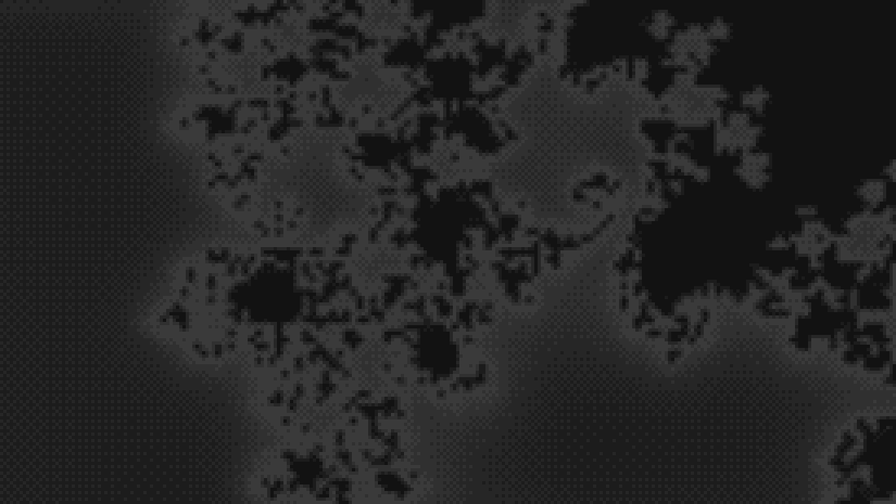

# canvas-effects

Seven animated, ordered-dithered greyscale backgrounds for a 2D canvas. They are built to sit **behind body text**. They modulate the
page colour rather than becoming a picture, and stay quiet enough that a reader should not consciously notice them.

No WebGL, no shaders, no dependencies. A 2D context, some typed arrays and `putImageData`. All seven together are 15.6 kB
minified and gzipped.

The `canvas-effects` name on the npm registry belongs to an unrelated package, so this one installs from GitHub. npm
aliases a Git URL under the package's own name, so imports stay `from 'canvas-effects'`:

```bash
npm install canvas-effects@github:TokyoDanInJapan/canvas-effects#v2.3.0
```

## The effects

Each takes a canvas and returns a handle. All seven respond to the pointer.


**Smoke** - `createSmokeBackground`. A fluid simulation: semi-Lagrangian advection with a Jacobi pressure projection, the
scheme from Jos Stam's _Stable Fluids_. It has momentum, so eddies get spun up by the flow and persist after whatever made
them has gone. Every ten seconds or so a jet fires in from a random edge, about half of them dark. _Drag to stir it._


**Plasma** - `createPlasmaBackground`. A domain warp: fractal Brownian motion folded into itself,
`fbm(p + fbm(p + fbm(p)))`, sampling a seamless tile. Stateless in time, so a frame can be drawn at any moment without
having drawn the ones before it. _Click or drag to send ripples out._


**Rain** - `createRainBackground`. One falling lane per column. Each head lights the cells it passes, and the whole field
fades every frame. So a trail is not drawn at all. It is simply what has not decayed yet. Streaks of falling light, not
glyphs. _Click or drag to send lens-like distortions through it._


**Ridges** - `createRidgesBackground`. A landscape flown over as a stack of profiles, each hiding the ones behind it. The
look is the ridgeline plot made famous by the cover of Joy Division's _Unknown Pleasures_. Optional `fill` makes them
solid silhouettes, `fillRandom` gives each its own colour. _Click or drag to set wobbles running through the stack._


**Metaballs** - `createMetaballsBackground`. An implicit surface. Point sources each add a falloff to a shared field, which is
then thresholded. Blobs bulge towards each other, fuse with a smooth neck, and part without a seam. Nothing in the
code knows about necks. _Press and drag to pick a blob up and throw it._


**Tunnel** - `createTunnelBackground`. The demoscene standby, and it is one division. Read a wall texture at
`(angle, depth / radius)`, and that reciprocal _is_ the perspective - no camera, no matrix, no depth buffer. The corridor
winds and the view banks into the turn, which costs one extra pass of a fixed-point iteration. _Press and drag to steer
it._



**Mandelbrot** - `createMandelbrotBackground`. A zoomer, and the interesting part is how you draw one in five greys at a
hundred and twenty cells across. Escape-time colouring cannot: the bands crowd together without limit at the boundary and
alias into noise exactly where the detail is. So it shades on a **distance estimate**, taken for free from the
picture's own gradient. The smooth escape count _is_ the exterior potential on a log scale. So `1 / (ln2 * |grad mu|)`
is the distance to the set, and a finite difference over a field already computed gives it.

It steers itself, because a target picked in advance is empty space twenty doublings later. Nor does it simply fall. It pauses to trace
sideways along the boundary at one magnification, and now and then gives up a couple of doublings for a wider look. It descends about 38 doublings, which is where a double runs out rather than where the iterations do.
_Press and drag to aim it._

## Quick start

```html
<canvas id="bg" aria-hidden="true"></canvas>

<style>
  #bg {
    position: fixed;
    inset: 0;
    width: 100%;
    height: 100%;
    z-index: -1;
    pointer-events: none;
    image-rendering: pixelated;
  }
</style>

<script type="module">
  import { createSmokeBackground } from 'canvas-effects';

  createSmokeBackground(document.getElementById('bg'), {
    shading: { base: 18, amplitude: 26 },
  });
</script>
```

Three things there are load-bearing, not decoration:

- **`image-rendering: pixelated`** - the canvas is drawn at one pixel per dither cell and stretched up by CSS. Let the
  browser smooth it and you have undone the entire dither.
- **`pointer-events: none`** - a full-bleed fixed canvas would otherwise eat every click on the page. It is also why every
  interaction listens on `window`: the canvas never sees a pointer itself.
- **`base` must match the colour of the page behind it.** The canvas is opaque and paints the page colour itself. A
  mismatch shows as a seam at the canvas edge.

`create*` returns **`null`** if the browser will not give up a 2D context. That is the one failure worth handling: the
page should carry on without a background rather than throw.

```js
const handle = createSmokeBackground(canvas, options);
if (!handle) canvas.remove();
```

## The handle

```js
handle.start(); // resume the loop
handle.stop(); // pause it, keep the state
handle.refresh(); // re-read shading and repaint
handle.destroy(); // stop and remove every listener
handle.running; // true while it is actually drawing
handle.still; // true while reduced motion holds it to one frame
handle.canvas; // the canvas it is mounted on
```

`destroy()` removes everything it added, so mounting and unmounting in a single-page app does not leak.

`running` and `still` are what a play/pause control wants. `running` is false while the tab is hidden or the loop is
stopped. `still` says _why_ `start()` may be refusing: the visitor has asked for less motion. The preference is
watched, not sampled once, so a visitor who changes their mind mid-visit gets the moving version without a reload.

## Shading

`shading` is either a fixed object or a function returning one. A function is re-read whenever the theme might have
changed - by default the library watches both the `class` on `<html>` and the OS `prefers-color-scheme`.

```js
createSmokeBackground(canvas, {
  shading: () => {
    const dark = document.documentElement.classList.contains('dark');
    return dark ? { base: 18, amplitude: 26 } : { base: 255, amplitude: -22 };
  },
});
```

- **`base`** - the page colour being modulated, 0-255. Must match what is behind the canvas.
- **`amplitude`** - how far the effect moves that colour. Negative moves it down, which is what a light theme wants.
  **This is the readability dial.**
- **`tint`** - optional `[r, g, b]` multipliers on `amplitude`. Only the modulation is tinted, never `base`, so the effect
  reads as coloured light over the page rather than a coloured rectangle.
- **`ramp`** - optional colour ramp, below.
- **`range`** - optional `[min, max]` slice of the spectrum, each 0..1. Pins how dark and how light the two ends are
  allowed to go without retuning `amplitude`. `[0.15, 0.8]` softens both extremes, and with a `ramp` it reads just
  that slice of the ramp. A `min` above 0 moves the empty field off the page colour, so the canvas shows as a flat wash -
  raise it knowingly.

A theme change only re-shades. The field is untouched, because only the greys it maps onto have changed.

### Colour

A tint scales one hue. A **ramp** gives each palette level its own colour, which buys the one thing greyscale cannot: a
steep perceptual gradient. Five greys separate a rain streak's head from its tail far less sharply than five colours
climbing from black to white do.

```js
createRainBackground(canvas, {
  levels: 5,
  shading: {
    base: 18,
    amplitude: 0,
    ramp: [
      [18, 18, 18], // has to be your page colour
      [10, 54, 22],
      [22, 122, 46],
      [60, 200, 88],
      [190, 255, 200],
    ],
  },
});
```

Stops are sampled evenly, so ramp length and `levels` are independent. Three stops across a nine-level palette
interpolates. Nine across three takes the ends and the middle. `levels` decides how many distinct colours reach the
screen, and the ramp decides which. `buildPalette(shading, levels)` is exported if you want to see what a shading resolves to.

## Interaction

| Effect     | Press or drag                                                           |
| ---------- | ----------------------------------------------------------------------- |
| Smoke      | Stirs the fluid along the drag. Idle movement is ignored.               |
| Plasma     | Sends ripples out. A drag leaves a wake.                                |
| Rain       | Sends lens-like distortions through it.                                 |
| Ridges     | Sets wobbles running through the stack.                                 |
| Metaballs  | Picks the nearest blob up, carries it, and throws it when you let go.   |
| Tunnel     | Steers the vanishing point towards the pointer, easing back on release. |
| Mandelbrot | Aims the zoom at the nearest filigree to the pointer, on the way in.    |

`interactive: false` turns any of them off. Emissions are spaced by _distance_ along the drag rather than throttled by
time, so a slow careful drag lays down as densely as a fast one. Each effect also caps how many disturbances run at
once, and retires the **oldest** to make room. A long drag keeps responding instead of going quiet.

**One thing to know before enabling this on a page of prose.** A drag meant for the background is also a drag meant
for the browser's text selection, and both happen. The library does not touch `user-select` - whether reading or interacting
matters more is the page's decision, not a background's. Set it yourself if you want drags to belong to the
background. The demo does.

## Options

Every effect takes the same shape of options object. These are shared:

| Option                 | Default       | Does                                                                                                     |
| ---------------------- | ------------- | -------------------------------------------------------------------------------------------------------- |
| `pixelSize`            | `6`           | CSS pixels per rendered pixel - one dither cell. Bigger is cheaper. `1` renders at native resolution.    |
| `fieldScale`           | varies        | How much coarser the field is than the output, per axis.                                                 |
| `maxPixels`            | `160000`      | Ceiling on rendered pixels. Raises `pixelSize` on large windows.                                         |
| `levels`               | `5`           | Palette size, up to 256. Small on purpose - the dither makes it look smooth.                             |
| `dither`               | `'auto'`      | Off posterises flat: same palette, visible bands. `'auto'` is on above one CSS pixel a cell, off at one. |
| `gamma`                | varies        | Weights the field dark (above 1) or light (below).                                                       |
| `fps`                  | `24`          | Redraw rate.                                                                                             |
| `shading`              | auto          | The greys. See above.                                                                                    |
| `interactive`          | `true`        | Respond to the pointer.                                                                                  |
| `respectReducedMotion` | `true`        | Draw one frame and stop under `prefers-reduced-motion: reduce`.                                          |
| `pauseWhenHidden`      | `true`        | Stop the loop while the tab is hidden.                                                                   |
| `watchThemeClass`      | `true`        | Re-read `shading` when the `class` on `<html>` changes.                                                  |
| `watchColorScheme`     | `true`        | Re-read `shading` when the OS colour scheme changes.                                                     |
| `random`               | `Math.random` | Pass a seeded generator for a repeatable background.                                                     |

**`levels` has a ceiling that is not `levels`.** The palette is bytes, and a greyscale shading only spans `base` to
`base + amplitude`. At the default amplitude of 26 there are 27 distinct greys to be had, so asking for 64 and asking
for 256 both give you 27. Raise `amplitude` to suit, or use a `ramp`, which spans three channels and has far more room
in it. The dither shrinks itself out of the way as the palette fills: at 256 levels its nudge is half a byte.

### Running at native resolution

`pixelSize: 1` gives one rendered pixel per CSS pixel - no fat pixels, and no dither by default. Two things to know
before reaching for it:

- **`maxPixels` will quietly undo it.** It exists so a 4K window is not four times the work of a 1080p one. At the
  default of 160,000, a request for `1` on a 1280×800 window comes back as an effective `3`. Raise it to the window's
  own pixel count if you mean it. The `'auto'` dither follows the size the surface _settled_ at, so a request that got
  coarsened still dithers.
- **It is not cheap.** The output pass is one pixel of work per CSS pixel. That is 1,024,000 a frame on a 1280×800
  window, against 29,000 at the default `pixelSize: 6`. Measured at 18.7 ms a frame for the shading alone, before whatever
  generates the field.

Turning the dither off at that size is a choice about look, not a correction. The Bayer pattern is at the display's own
pitch there, which is exactly where dithering works best, and it blends into a genuinely smooth gradient. What `'auto'`
buys instead is crisp posterised regions with clean curved boundaries. That is unavailable at any coarser size, where
undithered output is just visible steps. `dither: true` keeps the smooth version at any size.

Three of those differ per effect, and the reasons are worth knowing:

| Effect     | `fieldScale` | `pixelSize` | `gamma` |
| ---------- | ------------ | ----------- | ------- |
| Smoke      | 2            | 6           | 1.6     |
| Plasma     | 2            | 6           | 1.18    |
| Metaballs  | 2            | 6           | 1       |
| Mandelbrot | 2            | **4**       | 1       |
| Rain       | **1**        | 6           | 1       |
| Ridges     | **1**        | **4**       | 1       |
| Tunnel     | **1**        | 6           | 1       |

`fieldScale: 1` wherever interpolating between cells would blur line art or smooth away fine structure. For the tunnel
that is the difference between visible rings and flat mottle. The Mandelbrot spends its `pixelSize` instead. It is the
one effect here whose subject has detail at every scale, so the dither grid is worth paying for. `gamma` above 1
weights the field towards its dark end. Below 1 brightens it, which nothing here currently wants but is there if your
field sits too dark. [How it works](docs/how-it-works.md) has the measurements behind each.

Each effect also has its own parameter group - `simulation`, `warp`, `rain`, `ridges`, `metaballs`, `tunnel`,
`mandelbrot` - merged over that effect's defaults. Every parameter is documented where it is declared, with a note on
what it does and where its default came from. The types are `SmokeParams`, `PlasmaWarpConfig`, `RainParams`,
`RidgeParams`, `MetaballParams`, `TunnelParams` and `MandelbrotParams`.

`undefined` is ignored rather than overriding a default, so forwarding your own optional config is safe:

```js
createSmokeBackground(canvas, { gamma: config.gamma }); // fine when config.gamma is undefined
```

## Performance

All seven draw at `fps` - 24 by default - rather than the refresh rate, and stop entirely when the tab is hidden.

What makes them cheap is that they render at **two resolutions**. The expensive field is computed coarsely and
interpolated up, then ordered-dithered per output pixel. That last part is a few multiply-adds and a table lookup. `maxPixels`
raises `pixelSize` on large windows, so 2560×1440 renders 147,000 pixels rather than 409,000.

For the smoke, `maxSimCells` is the number to reach for first, not `maxPixels`. The solver touches every cell a dozen
or more times a frame, where the shading touches each output pixel once. The Mandelbrot's `maxFieldCells` is the same
dial and matters more still, because it touches each cell a couple of hundred times. That is why its default is 10,000
where the tunnel's is 160,000.

## Accessibility

- The canvas is decoration. Mark it `aria-hidden="true"`.
- With `prefers-reduced-motion: reduce` all seven draw a single frame and stop, and pointer interaction is disabled. The
  stateful ones settle themselves first, so the still frame is smoke or mid-storm rain rather than an empty field. The
  Mandelbrot's is the whole set, which needs no settling to be worth looking at.
- With JavaScript off nothing is painted and the page keeps its ordinary background - the other reason `base` has to match
  your page colour.
- `amplitude` is the contrast dial. Keep it low enough that text over the background clears whatever contrast ratio you
  are targeting. A `ramp` or `tint` adds chroma contrast on top of luminance contrast, and colour-blind readers do not
  all benefit from it equally. Greyscale is the safer default, and is why it is the default.

## More

- **[How it works](docs/how-it-works.md)** - what each effect actually does, why, and where the numbers came from.
- **[`examples/vanilla.html`](examples/vanilla.html)** - the smallest thing that works, no build step.
- **[`examples/astro/`](examples/astro)** - Astro components, including the view-transitions handling.
- **[`demo/`](demo)** - the live tuning page, every dial as a slider. `npm run dev`.

Everything is exported, and the maths is DOM-free so it can be used and tested outside a browser. The fluid solver, the
warp, the falling lanes, the terrain, the implicit surface, the tunnel projection and the set with the camera that flies
it are all usable on their own.

Writing an eighth is `mountBackground`, which is what the seven above are. Hand it a `rebuild`, a `field` and a `step`.
It does the canvas, the sizing, the dithered shading, the frame loop, the theme watching and the teardown.
`createSurface` is the layer under that, if you would rather drive the loop yourself.

## Development

```bash
npm install
npm run dev      # the demo page
npm test         # vitest
npm run check    # types, lint, format
npm run build    # dist/, via tsc
```

The tests cover the maths, because that is the part with properties worth asserting. The pressure projection really
does remove the divergence. The Bayer matrix really does average to 0.5. The MacCormack clamp really does keep density
in range. The canvas and loop code is exercised by the demo page.

## Licence

MIT - see [LICENSE](LICENSE).

All seven implement published techniques. Those are Jos Stam's _Stable Fluids_, domain-warped fbm, Wyvill's falloff for
the metaballs, the demoscene reciprocal tunnel, the Douady-Hubbard potential with the distance estimate that follows
from it, and ordered dithering on a Bayer matrix throughout. Where a well-known constant is used, it is credited at the
point of use: MurmurHash3's public-domain finalisers in `hash2`, and the classic 4×4 Bayer matrix.
