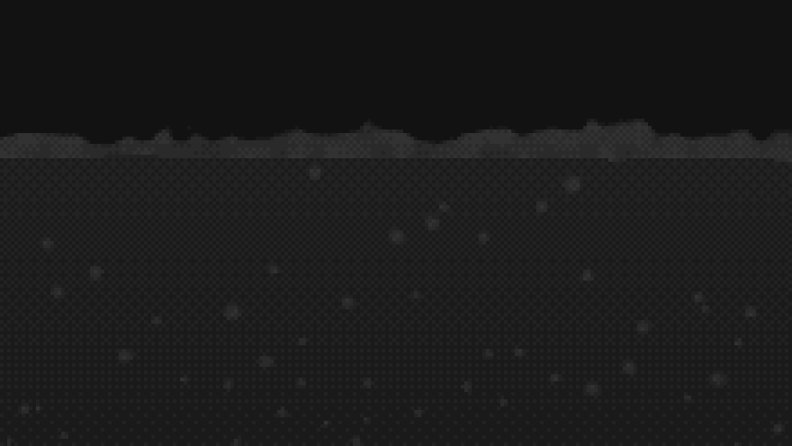

# canvas-effects

Eight animated greyscale backgrounds for a 2D canvas, with ordered dithering. They sit behind body text. Each one
changes the page colour slightly and does not become a picture, so a reader should not notice it.

There is no WebGL, no shaders and no dependencies. The library uses a 2D context, typed arrays and `putImageData`. All
eight effects together are 23.0 kB minified and gzipped.

An unrelated package already uses the name `canvas-effects` on npm, so install this one from GitHub. npm keeps the
package's own name, so imports are still `from 'canvas-effects'`.

```bash
npm install canvas-effects@github:TokyoDanInJapan/canvas-effects#v2.6.0
```

## The effects

Each effect takes a canvas and returns a handle. All eight respond to the pointer.


**Smoke** (`createSmokeBackground`) is a fluid simulation. It uses semi-Lagrangian advection with a Jacobi pressure
projection, from Jos Stam's _Stable Fluids_. The fluid has momentum, so eddies form in the flow and stay after their
cause has gone. About every ten seconds a jet fires in from a random edge. About half the jets are dark. _Drag to stir
it._


**Plasma** (`createPlasmaBackground`) is a domain warp. Fractal Brownian motion is folded into itself as
`fbm(p + fbm(p + fbm(p)))`, and the result samples a seamless tile. It has no state, so any frame can be drawn without
the frames before it. _Click or drag to send ripples out._


**Rain** (`createRainBackground`) has one falling lane per column. Each head lights the cells it passes, and the whole
field fades every frame. Nothing draws the trails. A trail is the part that has not faded yet. The rain is streaks of
light, with no characters. _Click or drag to send lens-like distortions through it._


**Ridges** (`createRidgesBackground`) flies over a landscape drawn as a stack of profiles. Each profile hides the ones
behind it, like the cover of Joy Division's _Unknown Pleasures_. `fill` makes the profiles solid, and `fillRandom` gives
each one its own colour. _Click or drag to send wobbles through the stack._


**Metaballs** (`createMetaballsBackground`) is an implicit surface. Each point source adds a falloff to a shared field,
and a threshold turns the field into a surface. Blobs bulge towards each other, join with a smooth neck and separate
cleanly. No code draws the necks. _Press and drag to pick up a blob and throw it._


**Tunnel** (`createTunnelBackground`) is the classic demoscene tunnel. It reads a wall texture at
`(angle, depth / radius)`, and that division gives the perspective. There is no camera, matrix or depth buffer. The
corridor bends and the view banks into each turn, for the cost of one more pass of a fixed-point iteration. _Press and
drag to steer it._


**Mandelbrot** (`createMandelbrotBackground`) zooms into the Mandelbrot set in five greys, 120 cells across.
Escape-time colouring fails at that size, because the bands crowd together at the boundary and turn into noise. This
effect shades on a **distance estimate** instead. The smooth escape count is the exterior potential on a log scale, so
`1 / (ln2 * |grad mu|)` gives the distance to the set. A finite difference over the field already computed gives
`grad mu`.

The zoom steers itself, because a target chosen at the start is empty space 20 doublings later. It also pauses to follow
the boundary sideways, and sometimes backs out a few doublings for a wider view. It goes about 38 doublings deep, which
is the limit of double precision. _Press and drag to aim it._



**Beer** (`createBeerBackground`) is a glass of fizzing beer. Bubbles rise from fixed nucleation sites, grow as the
pressure drops and burst at the surface. The bubbles are metaballs, so two that pass close together join. Nothing draws
the head. Each burst adds foam, the foam drains and spreads, and the head is as thick as those two rates allow.

The surface is shallow water, with a height for each column and a flow between columns. As a result, waves cross a full
glass faster than a half-full one. A crest driven too hard breaks into foam and spray. After a stir, the beer piles up
against a wall and swings back. Set `pour: true` to start with an empty glass that fills itself. To colour the beer
amber, give `shading` a `ramp`. _Drag to stir it. Click to splash it._

## Quick start

```html
<canvas id="bg" aria-hidden="true"></canvas>

<style>
  #bg {
    position: fixed;
    inset: 0;
    width: 100%;
    height: 100%;
    z-index: -1;
    pointer-events: none;
    image-rendering: pixelated;
  }
</style>

<script type="module">
  import { createSmokeBackground } from 'canvas-effects';

  createSmokeBackground(document.getElementById('bg'), {
    shading: { base: 18, amplitude: 26 },
  });
</script>
```

Three parts of this example are necessary:

- **`image-rendering: pixelated`**: the canvas has one pixel per dither cell, and CSS stretches it. If the browser
  smooths it, the dither is lost.
- **`pointer-events: none`**: without it, the canvas catches every click on the page. For this reason, the library
  listens for the pointer on `window`.
- **`base`** must be the colour of the page. The canvas is opaque and paints the page colour itself. If the colours are
  different, you see a line at the canvas edge.

Each `create*` function returns `null` if the browser gives no 2D context. Handle this case so that the page continues
without a background:

```js
const handle = createSmokeBackground(canvas, options);
if (!handle) canvas.remove();
```

## The handle

```js
handle.start(); // resume the loop
handle.stop(); // pause it, keep the state
handle.refresh(); // re-read shading and repaint
handle.destroy(); // stop and remove every listener
handle.running; // true while it is drawing
handle.still; // true while reduced motion holds it to one frame
handle.canvas; // the canvas it is mounted on
```

`destroy()` removes everything that the handle added, so mounting and unmounting in a single-page app does not leak.

Use `running` and `still` for a play and pause control. `running` is false while the tab is hidden or the loop is
stopped. `still` is true when the visitor has asked for reduced motion, which is why `start()` does nothing. The library
watches that preference, so if the visitor changes it, the animation starts without a reload.

## Shading

`shading` is an object, or a function that returns one. The library calls the function again when the theme can have
changed. By default it watches the `class` on `<html>` and the OS `prefers-color-scheme`.

```js
createSmokeBackground(canvas, {
  shading: () => {
    const dark = document.documentElement.classList.contains('dark');
    return dark ? { base: 18, amplitude: 26 } : { base: 255, amplitude: -22 };
  },
});
```

- **`base`**: the page colour, 0 to 255. It must match the colour behind the canvas.
- **`amplitude`**: how far the effect moves the colour away from `base`. Use a negative value for a light theme. **This
  setting controls readability.**
- **`tint`**: optional `[r, g, b]` multipliers on `amplitude`. The tint applies to the change only, never to `base`. As a
  result, the effect looks like coloured light on the page.
- **`ramp`**: an optional list of colours. See [Colour](#colour).
- **`range`**: an optional `[min, max]` part of the palette, each 0 to 1. It limits how dark and how light the effect
  goes, without a change to `amplitude`. `[0.15, 0.8]` softens both ends. With a `ramp`, it uses only that part of the
  ramp. If `min` is above 0, empty areas are no longer the page colour, so the canvas shows as a flat block.

A theme change only changes the greys. The field stays the same.

### Colour

A tint changes one hue. A **ramp** gives each palette level its own colour. This gives a steeper change in brightness
than greys can. For example, five colours from black to white separate the head of a rain streak from its tail much
more clearly than five greys do.

```js
createRainBackground(canvas, {
  levels: 5,
  shading: {
    base: 18,
    amplitude: 0,
    ramp: [
      [18, 18, 18], // must be your page colour
      [10, 54, 22],
      [22, 122, 46],
      [60, 200, 88],
      [190, 255, 200],
    ],
  },
});
```

The library samples the ramp at even steps, so the ramp length and `levels` are independent. Three colours across nine
levels are interpolated. Nine colours across three levels give the two ends and the middle. `levels` sets how many
colours reach the screen, and the ramp sets which colours. To see the palette that a shading gives, call
`buildPalette(shading, levels)`.

## Interaction

| Effect     | Press or drag                                                                   |
| ---------- | ------------------------------------------------------------------------------- |
| Smoke      | Stirs the fluid along the drag. Movement without a press does nothing.          |
| Plasma     | Sends ripples out. A drag leaves a wake.                                        |
| Rain       | Sends lens-like distortions through it.                                         |
| Ridges     | Sends wobbles through the stack.                                                |
| Metaballs  | Picks up the nearest blob, carries it and throws it when you release.           |
| Tunnel     | Steers the vanishing point towards the pointer. It moves back when you release. |
| Mandelbrot | Aims the zoom at the boundary nearest the pointer, while zooming in.            |
| Beer       | A drag stirs the bubbles and sloshes the beer. A press splashes it.             |

Set `interactive: false` to turn interaction off. A drag adds disturbances by distance moved, not by time. As a result,
a slow drag has the same effect as a fast one. Each effect limits how many disturbances run at the same time, and
removes the oldest to make room. A long drag therefore continues to have an effect.

**A drag on the background also selects text.** The library does not change `user-select`, because the page must decide
whether reading or interaction is more important. If you want drags to go to the background, set `user-select: none`
yourself. The demo does this.

## Options

Every effect takes the same options object. These options are shared:

| Option                 | Default       | Does                                                                                      |
| ---------------------- | ------------- | ----------------------------------------------------------------------------------------- |
| `pixelSize`            | varies        | CSS pixels per rendered pixel, which is one dither cell. Larger is faster. `1` is native. |
| `fieldScale`           | varies        | How much coarser the field is than the output, on each axis.                              |
| `maxPixels`            | `160000`      | Maximum number of rendered pixels. On large windows, it increases `pixelSize`.            |
| `levels`               | `5`           | Palette size, up to 256. The dither makes a small palette look smooth.                    |
| `dither`               | `'auto'`      | `false` gives visible bands. `'auto'` dithers above one CSS pixel per cell.               |
| `gamma`                | varies        | Above 1 makes the field darker. Below 1 makes it lighter.                                 |
| `polar`                | off           | Wraps the field round a centre. `true` uses the defaults. See [Polar](#polar).            |
| `fps`                  | `24`          | Frames per second.                                                                        |
| `shading`              | auto          | The greys. See [Shading](#shading).                                                       |
| `interactive`          | `true`        | Responds to the pointer.                                                                  |
| `respectReducedMotion` | `true`        | Draws one frame and stops under `prefers-reduced-motion: reduce`.                         |
| `pauseWhenHidden`      | `true`        | Stops the loop while the tab is hidden.                                                   |
| `watchThemeClass`      | `true`        | Reads `shading` again when the `class` on `<html>` changes.                               |
| `watchColorScheme`     | `true`        | Reads `shading` again when the OS colour scheme changes.                                  |
| `random`               | `Math.random` | A seeded generator gives the same background each time.                                   |

These defaults are different for each effect:

| Effect     | `fieldScale` | `pixelSize` | `gamma` |
| ---------- | ------------ | ----------- | ------- |
| Smoke      | 2            | 6           | 1.6     |
| Plasma     | 2            | 6           | 1.18    |
| Metaballs  | 2            | 6           | 1       |
| Mandelbrot | 2            | **4**       | 1       |
| Rain       | **1**        | 6           | 1       |
| Ridges     | **1**        | **4**       | 1       |
| Tunnel     | **1**        | 6           | 1       |
| Beer       | **1**        | **3**       | 1       |

Beer also defaults to 64 `levels`, because five greys cut its smooth depth gradient into bands.

Effects made of lines or fine detail use `fieldScale: 1`, because interpolation blurs them. For the tunnel,
interpolation removes the rings. The Mandelbrot has detail at every scale, so it uses a smaller `pixelSize`. The ridges
and the beer use a smaller `pixelSize` because their lines and bubbles are thin. [How it works](docs/how-it-works.md)
gives the measurements.

Each effect also has its own group of parameters, which the library merges over that effect's defaults. The groups are
`simulation`, `warp`, `rain`, `ridges`, `metaballs`, `tunnel`, `mandelbrot` and `beer`. The types are `SmokeParams`,
`PlasmaWarpConfig`, `RainParams`, `RidgeParams`, `MetaballParams`, `TunnelParams`, `MandelbrotParams` and
`BeerParams`. The source documents each parameter where it is declared.

An `undefined` value does not replace a default, so you can pass your own optional settings through:

```js
createSmokeBackground(canvas, { gamma: config.gamma }); // fine when config.gamma is undefined
```

### The limit on `levels`

The palette is made of bytes. A grey shading goes from `base` to `base + amplitude` only. At an amplitude of 26 there
are 27 greys, so 64 levels and 256 levels both give 27. To get more, increase `amplitude` or use a `ramp`, which has
three channels. The dither becomes smaller as the palette fills. At 256 levels, it moves a value by half a byte.

### Polar

`polar` changes how the canvas reads the field, and does not change the field. Each effect draws its rectangle as
usual. Then one axis becomes the angle about a centre, and the other axis becomes the distance from it. The rain falls
outwards from the centre, the ridges become rings and the tunnel curves back on itself. With `reverse: true` the
picture turns inside out, so the rain falls inwards. Polar works with all eight effects, because it does not change
them.

```js
createRainBackground(canvas, { polar: true });

createRidgesBackground(canvas, {
  polar: { turns: 3, centre: [0.5, 0], radius: 1.2 },
});
```

| Field       | Default      | Does                                                                                      |
| ----------- | ------------ | ----------------------------------------------------------------------------------------- |
| `centre`    | `[0.5, 0.5]` | The centre, as fractions of the canvas. A centre outside `0..1` gives a fan.              |
| `turns`     | `1`          | Copies of the field in one turn. Use a whole number.                                      |
| `rotate`    | `0`          | Turns the picture clockwise, in turns.                                                    |
| `radius`    | `1`          | How far out the field reaches. At `1`, it reaches the corners.                            |
| `seam`      | `'mirror'`   | `'mirror'` hides the join. `'wrap'` keeps the field the right way round, with a join.     |
| `angleAxis` | `'x'`        | The axis that becomes the angle. `'x'` makes rows into rings. `'y'` makes columns spokes. |
| `reverse`   | `false`      | Turns the radius inside out, so the centre moves to the edge and the edge to the centre.  |

**Choose the seam carefully.** The left and right edges of a field usually do not match, so a circle made from it has a
join. `'mirror'` reflects the field at each edge instead. This has no join, and the picture is symmetrical about the
fold. Use `'wrap'` when the field already wraps (for example, the plasma), or when you want the join.

Polar has two costs:

- **The centre sparkles.** One pixel at the centre covers every angle, so the cells nearest the centre look noisy. To
  avoid this, move `centre` off the canvas.
- **It uses more memory.** The lookup is a table of two floats per rendered pixel, rebuilt on resize. At the default
  `maxPixels` the table is about 1.3 MB. The time per frame does not change.

A press or drag goes through the same transform, so the disturbance appears under the pointer.

### Native resolution

`pixelSize: 1` gives one rendered pixel per CSS pixel, with no dither by default. Before you use it, note two things:

- **`maxPixels` can override it.** `maxPixels` stops a 4K window from costing four times as much as a 1080p window. At
  the default of 160,000, a `pixelSize` of `1` on a 1280×800 window becomes `3`. To prevent this, set `maxPixels` to the
  pixel count of the window. The `'auto'` dither uses the final size, so a coarsened surface still dithers.
- **It is slow.** The output pass does one pixel of work per CSS pixel. On a 1280×800 window that is 1,024,000 pixels a
  frame, against 29,000 at `pixelSize: 6`. The shading alone took 18.7 ms a frame.

At native resolution, `'auto'` turns the dither off to give crisp areas of flat colour with clean edges. That look is
possible only at this size. `dither: true` gives a smooth gradient at any size.

## Performance

All eight effects draw at `fps` (24 by default), not at the refresh rate. They stop when the tab is hidden.

They are fast because they render at **two resolutions**. The library computes the expensive field at a low resolution
and interpolates it up. Then it dithers each output pixel, which costs a few multiply-adds and a table lookup.
`maxPixels` increases `pixelSize` on large windows, so a 2560×1440 window renders 147,000 pixels, not 409,000.

The beer renders in three parts. The air is one fill, the deep beer is one fill per row, and only the band around the
surface costs work per cell. As a result, the cost depends on the surface band, not on the window size. The bubbles find
merges with a sorted sweep, not by checking every pair, so the cost of more `maxBubbles` is almost linear.

For the smoke, change `maxSimCells` before `maxPixels`. The solver uses every cell a dozen or more times a frame, but
the shading uses each output pixel once. The Mandelbrot's `maxFieldCells` has the same effect and matters more, because
the Mandelbrot uses each cell a few hundred times. For this reason its default is 10,000, and the tunnel's is 160,000.

## Accessibility

- The canvas is decoration. Mark it `aria-hidden="true"`.
- Under `prefers-reduced-motion: reduce`, all eight effects draw one frame and stop, and pointer interaction is off. The
  effects with state run for a while before that frame, so the frame shows smoke or rain, not an empty field. The
  Mandelbrot shows the whole set, and the beer shows a full glass.
- With JavaScript off, the canvas shows nothing and the page keeps its usual background. This is another reason that
  `base` must match the page colour.
- `amplitude` controls contrast. Keep it low enough that text on the background meets your contrast target. A `ramp` or
  `tint` adds colour contrast, but not all colour-blind readers see it. For this reason, greyscale is the default.

## More

- **[How it works](docs/how-it-works.md)**: what each effect does, why, and where the numbers come from.
- **[`examples/vanilla.html`](examples/vanilla.html)**: the smallest working example, with no build step.
- **[`examples/astro/`](examples/astro)**: Astro components, including view transitions.
- **[`demo/`](demo)**: the tuning page, with a slider for every setting. Run `npm run dev`.

Everything is exported. The maths does not use the DOM, so you can use it and test it outside a browser. You can use the
fluid solver, the warp, the rain lanes, the terrain, the implicit surface, the tunnel projection, the Mandelbrot camera
and the beer on their own.

To write a new effect, use `mountBackground`. The eight effects use it too. Give it a `rebuild`, a `field` and a `step`.
It handles the canvas, sizing, dithered shading, frame loop, theme watching and teardown. If you want to run the loop
yourself, use `createSurface`, which is the layer below.

## Development

```bash
npm install
npm run dev      # the demo page
npm test         # vitest
npm run check    # types, lint, format, package
npm run build    # dist/, via tsc
```

The tests cover the maths, because the maths has properties that a test can check. For example, the pressure projection
removes the divergence, the Bayer matrix averages to 0.5 and the MacCormack clamp keeps density in range. The demo page
exercises the canvas and loop code.

## Licence

MIT. See [LICENSE](LICENSE).

All eight effects use published techniques:

- Jos Stam's _Stable Fluids_
- domain-warped fbm
- Wyvill's falloff, for the metaballs
- the demoscene reciprocal tunnel
- the Douady-Hubbard potential and its distance estimate
- ordered dithering on a Bayer matrix

The source credits well-known constants where it uses them. These are the public-domain MurmurHash3 finalisers in
`hash2`, and the classic 4×4 Bayer matrix.
